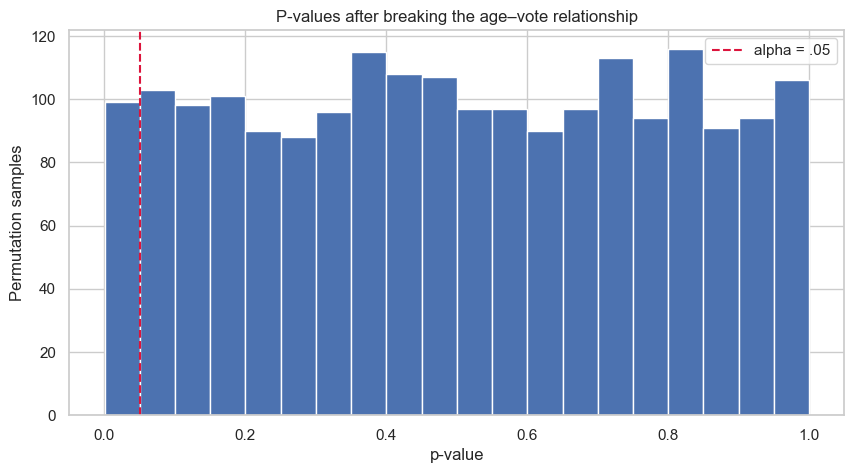

# Lesson 1: The Logic of Hypothesis Testing

> **Authoritative lesson:** This Markdown file is the maintained teaching source. The notebook is a supporting,
> executable example and should not be used to overwrite this lesson.

## Lesson overview

Hypothesis testing is a structured way to compare observed evidence with a precisely defined reference model.

### Why this matters

It turns a research claim into an auditable decision while keeping uncertainty, effect magnitude, and assumptions visible.

### Prerequisites

Descriptive statistics, samples and populations, means, standard deviations, and basic Python.

## Learning objectives

1. Translate a research question into a population parameter, null hypothesis, and alternative hypothesis
2. Explain p-values, significance levels, Type I errors, and Type II errors without common misconceptions
3. Connect hypothesis tests to confidence intervals and effect sizes
4. Distinguish statistical significance from practical significance

## Concept map

The lesson covers the following concepts explicitly.

| Concept | Meaning | Teaching section |
|---|---|---|
| Research question, parameter, and estimand | The quantity the analysis is intended to learn about. | [1.1 From a question to a testable claim](#11-from-a-question-to-a-testable-claim) |
| Null and alternative hypotheses | Reference and competing claims, including one- and two-sided alternatives. | [1.1 From a question to a testable claim](#11-from-a-question-to-a-testable-claim) |
| p-value interpretation | Compatibility with the null model rather than the probability that the null is true. | [1.2 What a p-value is—and is not](#12-what-a-p-value-is-and-is-not) |
| Significance level and permutation-null false positives | Long-run rejection behavior after breaking the observed age–vote relationship. | [1.2 What a p-value is—and is not](#12-what-a-p-value-is-and-is-not) |
| Signal-to-noise test statistic | Estimate minus null value divided by its standard error. | [1.3 Test statistics, confidence intervals, and effect sizes](#13-test-statistics-confidence-intervals-and-effect-sizes) |
| Confidence intervals and test decisions | Connection between a two-sided test and a compatible interval. | [1.3 Test statistics, confidence intervals, and effect sizes](#13-test-statistics-confidence-intervals-and-effect-sizes) |
| One-sample Cohen's d | Standardized distance between a sample mean and its null value. | [1.3 Test statistics, confidence intervals, and effect sizes](#13-test-statistics-confidence-intervals-and-effect-sizes) |

## Data used in this lesson

The examples use the local, documented real-data bundle. See the [dataset guide](../../data/readme.md) for provenance,
variable definitions, cleaning decisions, and reuse notes.

| Dataset | Observation unit | Lesson use | Interpretation boundary |
|---|---|---|---|
| ANES 1996 | one survey respondent | Age and expected-vote labels illustrate a permutation null and a one-sample mean test. | The survey comparison is observational; the benchmark age of 45 is a teaching choice. |

## Notebook setup

The examples use the shared scientific-Python setup described in the
[Notebook Implementation Toolkit](../../docs/maintenance/notebook_toolkit.md). That reference explains imports, deterministic random-number
generation, plotting configuration, output behavior, and why global warning suppression is discouraged.

## 1.1 From a question to a testable claim

A useful hypothesis test begins with a **design**, not with a software menu.

| Question | Parameter | Typical null | Typical alternative |
|---|---:|---|---|
| Is a mean different from a target? | $\mu$ | $\mu=\mu_0$ | $\mu\ne\mu_0$ |
| Do two groups have different means? | $\mu_1-\mu_2$ | $\mu_1-\mu_2=0$ | $\mu_1-\mu_2\ne0$ |
| Did a conversion rate change? | $p_1-p_2$ | $p_1-p_2=0$ | $p_1-p_2\ne0$ |
| Are two categorical variables associated? | joint probabilities | independence | association |

The **null hypothesis** is a precise reference model. The **alternative** describes departures
that matter for the question. A two-sided alternative is the default unless direction was justified
before observing the data.


## 1.2 What a p-value is—and is not

A p-value is the probability, **assuming $H_0$ and the model assumptions are true**, of obtaining
a test statistic at least as incompatible with $H_0$ as the observed statistic.

It is **not**:

- the probability that $H_0$ is true;
- the probability the result happened "by chance";
- the size or importance of an effect;
- a guarantee that the result will replicate.

At level $\alpha$, reject $H_0$ when $p\le\alpha$. Otherwise, **fail to reject** $H_0$.
Failure to reject is not proof of no effect; it can reflect imprecision or low power.


```python
# Use real ANES ages and expected-vote labels to build a permutation null.
anes = pd.read_csv(DATA_DIR / "anes96_clean.csv")
ages = anes["age_years"].to_numpy()
vote = anes["expected_vote"].to_numpy()
n_dole = np.sum(vote == "Dole")

p_values = []
for _ in range(2000):
    shuffled = rng.permutation(vote)
    dole_age = ages[shuffled == "Dole"]
    clinton_age = ages[shuffled == "Clinton"]
    p_values.append(stats.ttest_ind(dole_age, clinton_age, equal_var=False).pvalue)

p_values = np.asarray(p_values)
print(f"Permutation-null rejection rate at alpha=.05: {(p_values < .05).mean():.3f}")

fig, ax = plt.subplots()
ax.hist(p_values, bins=20, edgecolor="white")
ax.axvline(.05, color="crimson", linestyle="--", label="alpha = .05")
ax.set(xlabel="p-value", ylabel="Permutation samples",
       title="P-values after breaking the age–vote relationship")
ax.legend()
plt.show()

```

    Permutation-null rejection rate at alpha=.05: 0.050


    

    


## 1.3 Test statistics, confidence intervals, and effect sizes

Most test statistics have the form

$$\text{signal-to-noise} = \frac{\text{estimate}-\text{null value}}{\text{standard error}}.$$

A compatible confidence interval answers a richer question: which parameter values remain plausible?
For a two-sided test at $\alpha=.05$, a 95% confidence interval that excludes the null value leads to
rejection at the same level. Always pair the test with an effect size in the outcome's natural units.


```python
# One-sample example using respondents' real ages.
sample = anes["age_years"].dropna().to_numpy()
null_mean = 45
result = stats.ttest_1samp(sample, popmean=null_mean)
estimate = sample.mean()
se = sample.std(ddof=1) / np.sqrt(len(sample))
ci = stats.t.interval(.95, df=len(sample)-1, loc=estimate, scale=se)
d = (estimate-null_mean) / sample.std(ddof=1)

pd.Series({"sample mean age": estimate, "mean difference from 45": estimate-null_mean,
           "95% CI low": ci[0], "95% CI high": ci[1], "t": result.statistic,
           "p": result.pvalue, "Cohen d": d, "n": len(sample)})

```


    sample mean age             47.0434
    mean difference from 45      2.0434
    95% CI low                  45.9944
    95% CI high                 48.0924
    t                            3.8229
    p                            0.0001
    Cohen d                      0.1244
    n                          944.0000
    dtype: float64


## Worked example and interpretation

### What the analysis does

The first calculation uses 944 ANES respondents and separates their ages by expected vote. It repeatedly shuffles the vote labels while keeping the observed ages fixed, then recomputes a two-group test. This destroys the age–vote association and creates a reference distribution for a null world. In 2,000 shuffled datasets, about 5.0% of the resulting p-values fell below the preselected 0.05 threshold. That is the expected long-run false-rejection behavior under this particular permutation setup, not the probability that a particular null hypothesis is true.

### What the result means

A second calculation compares the respondents' mean age, 47.04 years, with a teaching benchmark of 45 years. The estimated difference is 2.04 years; the 95% confidence interval for the mean age is 45.99 to 48.09, and Cohen's d is 0.124. The small p-value reflects high precision with 944 observations, while the standardized difference is small. The benchmark was chosen for instruction, so this result does not establish an important real-world age threshold. Both analyses illustrate why the design, reference model, magnitude, and interval must be read together.

## Practice and solution

**Practice.** A result has $p=.08$ and a 95% CI for the mean difference of $[-0.4, 6.2]$.
What can you conclude?

<details><summary>Solution</summary>

At alpha = .05, fail to reject a two-sided null of zero difference because the interval includes zero.
The data are compatible with a small negative effect through a moderately positive effect, so the
estimate is too imprecise to conclude either "no effect" or a clearly useful benefit.
</details>

## Summary

1. Begin with the estimand and design.
2. A p-value measures compatibility with a null model, not truth or importance.
3. Confidence intervals and effect sizes carry information a binary decision discards.


## Reproducibility checklist

- State the population, outcome, groups, and sampling unit.
- State $H_0$, $H_1$, alpha, and whether the test is one- or two-sided before looking at results.
- Verify independence from the design; use plots and diagnostics for distributional assumptions.
- Report the estimate, confidence interval, effect size, test statistic, degrees of freedom, and exact p-value.
- Separate statistical evidence from practical importance and acknowledge design limitations.

## Implementation reference

These APIs and code patterns are demonstrated in the supporting notebook.

| API or pattern | Purpose | Usage guidance |
|---|---|---|
| `scipy.stats.ttest_ind(..., equal_var=False)` | Test age differences after each permutation of the observed vote labels. | The permutation step creates the reference distribution; Welch's statistic measures each shuffled contrast. |
| `scipy.stats.ttest_1samp` | Test a sample mean against a benchmark. | Pair the p-value with a raw difference, interval, and effect size. |
| `scipy.stats.t.interval` | Construct a t-based confidence interval. | Supply degrees of freedom, location, and standard error explicitly. |
| `numpy.random.Generator.permutation` | Break the age–vote relationship while retaining the observed values. | Permute labels only when exchangeability is justified by the null model or design. |

## Best practices

- Define the estimand and sidedness before examining results.
- Report estimates and intervals before binary decisions.
- Use simulation to build intuition, not to replace design reasoning.

## Common mistakes and edge cases

- Reading a p-value as the probability that the null is true.
- Treating failure to reject as proof of no effect.
- Calling a statistically detectable effect practically important without a decision threshold.

## Additional practice

1. Write hypotheses for a two-sided comparison of a population mean with 100.
2. Explain why p=.08 and a wide interval can still be compatible with an important effect.

## Related lessons and source material

- **Next:** [Lesson 02 Sampling Distributions Errors and Power](lesson_02_sampling_distributions_errors_and_power.md)
- **Supporting notebook:** [lesson_01_the_logic_of_hypothesis_testing.ipynb](../lesson_01_the_logic_of_hypothesis_testing.ipynb)
- **Coverage record:** [Course Coverage Index](../../docs/maintenance/course_coverage_index.md#lesson-1-the-logic-of-hypothesis-testing)
