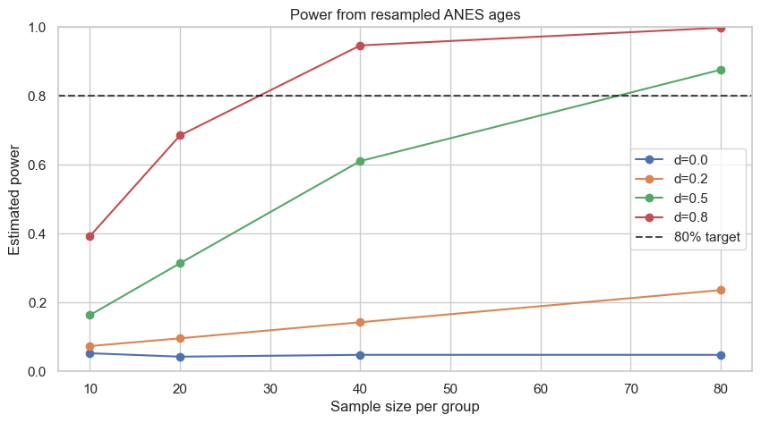

# Lesson 2: Sampling Distributions, Errors, and Power

> **Authoritative lesson:** This Markdown file is the maintained teaching source. The notebook is a supporting,
> executable example and should not be used to overwrite this lesson.

## Lesson overview

Power analysis studies how often a planned procedure detects a specified effect while controlling its false-positive rate.

### Why this matters

It connects sample size and minimum useful effects to a defensible design before data collection.

### Prerequisites

Lesson 1, probability, sampling variability, and the meaning of alpha.

## Learning objectives

1. Use sampling distributions to explain standard errors and critical regions
2. Relate alpha, effect size, sample size, variability, and power
3. Estimate power by simulation
4. Recognize optional stopping and post-hoc power as poor analysis practices

## Concept map

The lesson covers the following concepts explicitly.

| Concept | Meaning | Teaching section |
|---|---|---|
| Type I and Type II errors | False rejection versus failure to detect a specified alternative. | [2.1 Two kinds of decision error](#21-two-kinds-of-decision-error) |
| Statistical power | Probability of rejection for a specified true effect. | [2.1 Two kinds of decision error](#21-two-kinds-of-decision-error) |
| Power drivers | Effect size, sample size, variability, alpha, and test design. | [2.1 Two kinds of decision error](#21-two-kinds-of-decision-error) |
| Empirical power simulation | Resample observed ages, add a planned shift, apply the test, and estimate the rejection rate. | [2.1 Two kinds of decision error](#21-two-kinds-of-decision-error) |
| A priori sample-size planning | Solve for sample size from alpha, target power, and a minimum effect. | [2.2 Planning before data collection](#22-planning-before-data-collection) |
| Optional stopping | Repeated unplanned testing inflates false positives. | [2.2 Planning before data collection](#22-planning-before-data-collection) |
| Sensitivity analysis | Evaluate several plausible effects instead of treating one pilot estimate as known. | [2.2 Planning before data collection](#22-planning-before-data-collection) |

## Data used in this lesson

The examples use the local, documented real-data bundle. See the [dataset guide](../../data/readme.md) for provenance,
variable definitions, cleaning decisions, and reuse notes.

| Dataset | Observation unit | Lesson use | Interpretation boundary |
|---|---|---|---|
| ANES 1996 | one survey respondent | The observed age distribution is resampled for empirical power and its vote-group age contrast motivates a planning example. | The added standardized shifts are planning scenarios, not observed treatment effects. |

## Notebook setup

The examples use the shared scientific-Python setup described in the
[Notebook Implementation Toolkit](../../docs/maintenance/notebook_toolkit.md). That reference explains imports, deterministic random-number
generation, plotting configuration, output behavior, and why global warning suppression is discouraged.

## 2.1 Two kinds of decision error

| Reality | Do not reject $H_0$ | Reject $H_0$ |
|---|---|---|
| $H_0$ true | correct | Type I error ($\alpha$) |
| Meaningful alternative true | Type II error ($\beta$) | correct (power $=1-\beta$) |

Power is the long-run probability that a planned procedure rejects $H_0$ for a specified true effect.
It increases with larger effects, larger samples, lower noise, and (at a cost) larger $\alpha$.


```python
# Empirical power simulation based on the real ANES age distribution.
anes = pd.read_csv(DATA_DIR / "anes96_clean.csv")
age_pool = anes["age_years"].dropna().to_numpy()
age_sd = age_pool.std(ddof=1)

def empirical_power(effect, n, alpha=.05, repetitions=1500):
    """Resample real ages and add a planned standardized shift to one group."""
    rejections = 0
    for _ in range(repetitions):
        control = rng.choice(age_pool, size=n, replace=True)
        treatment = rng.choice(age_pool, size=n, replace=True) + effect*age_sd
        p = stats.ttest_ind(control, treatment, equal_var=False).pvalue
        rejections += p < alpha
    return rejections/repetitions

rows = []
for effect in [0.0, 0.2, 0.5, 0.8]:
    for n in [10, 20, 40, 80]:
        rows.append({"standardized effect": effect, "n per group": n,
                     "rejection rate": empirical_power(effect, n)})
power_table = pd.DataFrame(rows)
power_table.pivot(index="n per group", columns="standardized effect", values="rejection rate")

```


| ('standardized effect', 'n per group') | ('0.0', 'Unnamed: 1_level_1') | ('0.2', 'Unnamed: 2_level_1') | ('0.5', 'Unnamed: 3_level_1') | ('0.8', 'Unnamed: 4_level_1') |
|---|---|---|---|---|
| 10 | 0.0527 | 0.0733 | 0.1633 | 0.3927 |
| 20 | 0.0427 | 0.096 | 0.314 | 0.6853 |
| 40 | 0.048 | 0.1427 | 0.6107 | 0.9467 |
| 80 | 0.048 | 0.236 | 0.876 | 0.998 |


```python
fig, ax = plt.subplots()
for effect, group in power_table.groupby("standardized effect"):
    ax.plot(group["n per group"], group["rejection rate"], marker="o", label=f"d={effect}")
ax.axhline(.80, color="black", linestyle="--", alpha=.7, label="80% target")
ax.set(xlabel="Sample size per group", ylabel="Estimated power",
       ylim=(0, 1), title="Power from resampled ANES ages")
ax.legend()
plt.show()

```


    

    


## 2.2 Planning before data collection

Power calculations need a **minimum effect of practical interest**, not the effect observed in the same
noisy dataset. The planning effect should come from domain requirements, credible prior studies, or a
smallest effect that would change a decision.

Optional stopping—repeatedly testing and stopping as soon as $p<.05$—raises the false-positive rate.
Pre-specify the sample size or use a valid sequential design.


```python
from statsmodels.stats.power import TTestIndPower

# Use the observed age contrast only as a transparent planning illustration.
dole = anes.loc[anes["expected_vote"] == "Dole", "age_years"].to_numpy()
clinton = anes.loc[anes["expected_vote"] == "Clinton", "age_years"].to_numpy()
pooled_sd = np.sqrt(((len(dole)-1)*dole.var(ddof=1) + (len(clinton)-1)*clinton.var(ddof=1)) /
                    (len(dole)+len(clinton)-2))
observed_d = abs((dole.mean()-clinton.mean())/pooled_sd)

analysis = TTestIndPower()
required = analysis.solve_power(effect_size=observed_d, alpha=.05, power=.80, ratio=1)
achieved = analysis.power(effect_size=observed_d, nobs1=np.ceil(required), alpha=.05, ratio=1)
print(f"Observed ANES age effect size: d={observed_d:.3f}")
print(f"Illustrative required n per group: {np.ceil(required):.0f}")
print(f"Achieved power after rounding: {achieved:.3f}")

```

    Observed ANES age effect size: d=0.109
    Illustrative required n per group: 1325
    Achieved power after rounding: 0.800


## Worked example and interpretation

### What the analysis does

The power table resamples observed ANES ages to build two independent groups, then adds a *planned artificial shift* to one group. Each entry is the fraction of 1,500 repeated samples in which Welch's test rejects at alpha 0.05. When the added effect is zero, rejection stays near 0.05 across group sizes; this checks the simulated Type I error. For a standardized shift of 0.5, estimated power rises from 0.163 with 10 observations per group to 0.876 with 80. For a smaller shift of 0.2, even 80 per group gives only 0.236 estimated power. The plotted curves visualize these same design tradeoffs.

### What the planning calculation means

A separate illustration measures an ANES age contrast between expected-vote groups and uses its observed standardized difference, 0.109, as a provisional target. A two-sided 80% power calculation gives about 1,325 observations **per group** under its model. This is not the power of the completed ANES analysis and is not a recommended sample size: a future study must choose the smallest substantively important effect *before* collecting outcome data. Changing variability, allocation, alpha, or the target effect changes the required sample size.

## Practice and solution

**Practice.** Name two defensible ways to choose an effect for a priori power analysis.

<details><summary>Solution</summary>

Use a smallest effect that would change a scientific or business decision, or use a conservative
estimate from high-quality prior evidence. Do not select the observed effect from a small pilot as if it
were known precisely; use sensitivity analysis across plausible values instead.
</details>

## Summary

- Alpha controls false positives only under the planned procedure.
- Power is tied to a specific alternative and must be planned prospectively.
- Simulation is a flexible power tool when formulas do not match the design.


## Reproducibility checklist

- State the population, outcome, groups, and sampling unit.
- State $H_0$, $H_1$, alpha, and whether the test is one- or two-sided before looking at results.
- Verify independence from the design; use plots and diagnostics for distributional assumptions.
- Report the estimate, confidence interval, effect size, test statistic, degrees of freedom, and exact p-value.
- Separate statistical evidence from practical importance and acknowledge design limitations.

## Implementation reference

These APIs and code patterns are demonstrated in the supporting notebook.

| API or pattern | Purpose | Usage guidance |
|---|---|---|
| `statsmodels.stats.power.TTestIndPower` | Plan or evaluate independent two-sample t-test power. | The effect size is standardized Cohen's d. |
| `solve_power` | Solve for the unknown sample-size component. | Round required sample sizes upward. |
| `power` | Calculate achieved power for a specified design. | Prospective power is more useful than observed post-hoc power. |
| `DataFrame.pivot` and `groupby` | Reshape and plot a simulation grid. | These operations organize results; they do not change inferential assumptions. |

## Best practices

- Choose a minimum effect from a real decision threshold.
- Simulate the complete planned procedure when analytic formulas do not match the design.
- Pre-specify stopping rules.

## Common mistakes and edge cases

- Using the effect observed in the same small study as if it were known.
- Calling 80% power a universal law.
- Ignoring attrition, clustering, or multiplicity in the design calculation.

## Additional practice

1. Sketch how power changes if variance doubles while all other inputs remain fixed.
2. Design a sensitivity table for three plausible effect sizes and two power targets.

## Related lessons and source material

- **Previous:** [Lesson 01 The Logic of Hypothesis Testing](lesson_01_the_logic_of_hypothesis_testing.md)
- **Next:** [Lesson 03 One-Sample Tests for Means and Proportions](lesson_03_one_sample_tests_for_means_and_proportions.md)
- **Supporting notebook:** [lesson_02_sampling_distributions_errors_and_power.ipynb](../lesson_02_sampling_distributions_errors_and_power.ipynb)
- **Coverage record:** [Course Coverage Index](../../docs/maintenance/course_coverage_index.md#lesson-2-sampling-distributions-errors-and-power)
