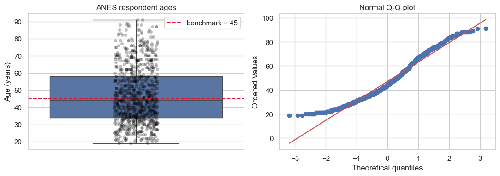

# Lesson 3: One-Sample Tests for Means and Proportions

> **Authoritative lesson:** This Markdown file is the maintained teaching source. The notebook is a supporting,
> executable example and should not be used to overwrite this lesson.

## Lesson overview

One-sample tests compare a population mean or proportion with a fixed benchmark.

### Why this matters

They support quality-control, target, baseline, and prevalence questions without introducing a second sample.

### Prerequisites

Lessons 1–2, standard errors, t distributions, and binomial outcomes.

## Learning objectives

1. Run and report a one-sample t-test with a confidence interval and standardized effect
2. Choose between an exact binomial test and a large-sample proportion test
3. Check assumptions and identify when a one-sample test cannot support a causal claim
4. Interpret one-sided tests correctly

## Concept map

The lesson covers the following concepts explicitly.

| Concept | Meaning | Teaching section |
|---|---|---|
| One-sample t-test | Test a quantitative population mean against a benchmark. | [3.1 One-sample mean](#31-one-sample-mean) |
| Independence and shape assumptions | Design-based independence plus distribution diagnostics for small samples. | [3.1 One-sample mean](#31-one-sample-mean) |
| Mean-difference confidence interval | Estimate uncertainty in natural units. | [3.1 One-sample mean](#31-one-sample-mean) |
| One-sample Cohen's d | Standardized benchmark difference. | [3.1 One-sample mean](#31-one-sample-mean) |
| Box, strip, and Q-Q diagnostics | Reveal spread, individual values, and departures from normality. | [3.1 One-sample mean](#31-one-sample-mean) |
| Exact binomial test | Test a binary proportion without a large-sample approximation. | [3.2 One-sample proportion](#32-one-sample-proportion) |
| Wilson proportion interval | A stable interval for a binomial proportion. | [3.2 One-sample proportion](#32-one-sample-proportion) |
| Cohen's h | Arcsine-scale standardized difference between proportions. | [3.2 One-sample proportion](#32-one-sample-proportion) |

## Data used in this lesson

The examples use the local, documented real-data bundle. See the [dataset guide](../../data/readme.md) for provenance,
variable definitions, cleaning decisions, and reuse notes.

| Dataset | Observation unit | Lesson use | Interpretation boundary |
|---|---|---|---|
| ANES 1996 | one survey respondent | Respondent age supports the one-sample mean example. | The age-45 benchmark is pedagogical, not a population claim. |
| Spector program | one student | Grade improvement supports the exact one-sample binomial example. | The 50% benchmark is a teaching reference. |

## Notebook setup

The examples use the shared scientific-Python setup described in the
[Notebook Implementation Toolkit](../../docs/maintenance/notebook_toolkit.md). That reference explains imports, deterministic random-number
generation, plotting configuration, output behavior, and why global warning suppression is discouraged.

## 3.1 One-sample mean

For independent quantitative observations, the one-sample t statistic is
$$t=\frac{\bar{x}-\mu_0}{s/\sqrt{n}},\qquad df=n-1.$$
Independence comes from the sampling process. For small samples, inspect the distribution for severe
skew or influential outliers; for large samples, the mean is often robust to modest non-normality.


```python
anes = pd.read_csv(DATA_DIR / "anes96_clean.csv")
respondent_age = anes["age_years"].dropna().to_numpy()
target = 45
test = stats.ttest_1samp(respondent_age, popmean=target)
n = len(respondent_age)
mean = respondent_age.mean()
sd = respondent_age.std(ddof=1)
ci = stats.t.interval(.95, n-1, loc=mean, scale=sd/np.sqrt(n))
d = (mean-target)/sd
pd.Series({"n": n, "mean age": mean, "SD": sd, "t": test.statistic,
           "df": n-1, "p": test.pvalue, "Cohen d": d,
           "CI low": ci[0], "CI high": ci[1]})

```


    n           944.0000
    mean age     47.0434
    SD           16.4231
    t             3.8229
    df          943.0000
    p             0.0001
    Cohen d       0.1244
    CI low       45.9944
    CI high      48.0924
    dtype: float64


```python
fig, axes = plt.subplots(1, 2, figsize=(11, 4))
sns.boxplot(y=respondent_age, ax=axes[0])
sns.stripplot(y=respondent_age, color="black", alpha=.25, ax=axes[0])
axes[0].axhline(target, color="crimson", linestyle="--", label="benchmark = 45")
axes[0].set(title="ANES respondent ages", ylabel="Age (years)")
axes[0].legend()
stats.probplot(respondent_age, dist="norm", plot=axes[1])
axes[1].set_title("Normal Q-Q plot")
plt.tight_layout(); plt.show()

```

    /Users/soroush/Library/Python/3.9/lib/python/site-packages/seaborn/categorical.py:632: FutureWarning: SeriesGroupBy.grouper is deprecated and will be removed in a future version of pandas.
      positions = grouped.grouper.result_index.to_numpy(dtype=float)
    /Users/soroush/Library/Python/3.9/lib/python/site-packages/seaborn/_base.py:948: FutureWarning: When grouping with a length-1 list-like, you will need to pass a length-1 tuple to get_group in a future version of pandas. Pass `(name,)` instead of `name` to silence this warning.
      data_subset = grouped_data.get_group(pd_key)


    

    


## 3.2 One-sample proportion

Use the exact binomial test when the sample is small or the null proportion is near 0 or 1. A normal
approximation is reasonable when $np_0$ and $n(1-p_0)$ are both sufficiently large. For intervals,
Wilson or exact intervals behave better than the simple Wald interval.


```python
spector = pd.read_csv(DATA_DIR / "spector_program.csv")
successes = int(spector["grade_improved"].sum())
trials = len(spector)
p0 = .50
exact = stats.binomtest(successes, trials, p=p0, alternative="two-sided")
ci = exact.proportion_ci(confidence_level=.95, method="wilson")
p_hat = successes/trials
cohen_h = 2*(np.arcsin(np.sqrt(p_hat))-np.arcsin(np.sqrt(p0)))
pd.Series({"students whose grade improved": successes, "n": trials, "p-hat": p_hat,
           "exact p": exact.pvalue, "Cohen h": cohen_h,
           "Wilson low": ci.low, "Wilson high": ci.high})

```


    students whose grade improved    11.0000
    n                                32.0000
    p-hat                             0.3438
    exact p                           0.1102
    Cohen h                          -0.3178
    Wilson low                        0.2041
    Wilson high                       0.5169
    dtype: float64


## Worked example and interpretation

### Mean benchmark

The ANES example takes 944 respondent ages and tests a mean of 45 years. It calculates the sample mean (47.04), standard deviation (16.42), standard error, t statistic (3.823 on 943 degrees of freedom), and a 95% interval for the mean (45.99 to 48.09). Cohen's d is 0.124, so the statistically detectable difference from 45 is small relative to age variation. The box-and-point plot shows individual spread against the benchmark; the Q–Q plot is a diagnostic for the shape of the ages, not a mechanical test-selection switch. Independence still depends on how respondents were sampled.

### Proportion benchmark

The Spector example counts 11 grade improvements among 32 students, an observed proportion of 0.344. It compares this with a **teaching** benchmark of 0.50 using a two-sided exact binomial test because the sample is small. The exact p-value is 0.110, while the Wilson 95% interval is 0.204 to 0.517 and Cohen's h is −0.318. These results leave both lower rates and the 0.50 reference compatible with the data; failing to reject does not establish equality. Neither benchmark comparison explains *why* the observed value differs.

## Practice and solution

**Practice.** A manufacturer claims fewer than 2% of parts are defective. In a random sample of 100,
4 are defective. Write the hypotheses and identify an appropriate test.

<details><summary>Solution</summary>

For a claim that the defect rate is below 2%, use $H_0:p\ge .02$ versus $H_1:p<.02$, operationally
tested at the boundary $p=.02$ with a one-sided exact binomial test. Because only two defects are
expected under the boundary null, the exact test is preferable to a normal approximation. Observing
four defects points opposite to the stated alternative, so the data cannot support "below 2%."
</details>

## Summary

- Match the parameter and direction to the claim before seeing results.
- Exact methods are especially useful for small or extreme proportions.
- A test of a benchmark does not establish why a sample differs from it.


## Reproducibility checklist

- State the population, outcome, groups, and sampling unit.
- State $H_0$, $H_1$, alpha, and whether the test is one- or two-sided before looking at results.
- Verify independence from the design; use plots and diagnostics for distributional assumptions.
- Report the estimate, confidence interval, effect size, test statistic, degrees of freedom, and exact p-value.
- Separate statistical evidence from practical importance and acknowledge design limitations.

## Implementation reference

These APIs and code patterns are demonstrated in the supporting notebook.

| API or pattern | Purpose | Usage guidance |
|---|---|---|
| `scipy.stats.ttest_1samp` | Return the t statistic and p-value for a mean benchmark. | The null value is passed through `popmean`. |
| `scipy.stats.probplot` | Create a normal Q-Q diagnostic. | Interpret the shape visually rather than using a mechanical pass/fail rule. |
| `scipy.stats.binomtest` | Run an exact binomial test. | This is the current API; deprecated `binom_test` should not be used. |
| `BinomTestResult.proportion_ci(method='wilson')` | Calculate the Wilson interval. | State the chosen confidence level and method. |
| `seaborn.boxplot` and `stripplot` | Combine a summary with raw observations. | Raw points make small-sample structure visible. |

## Best practices

- State whether the benchmark is scientific, operational, or arbitrary.
- Use an exact proportion test for small or extreme expected counts.
- Report the raw-unit difference even when a standardized effect is useful.

## Common mistakes and edge cases

- Diagnosing the raw sample instead of the relevant model quantity.
- Using a Wald proportion interval near zero or one.
- Choosing a one-sided test after observing the sample direction.

## Additional practice

1. Analyze 7 defects in 80 parts against a 5% benchmark using an exact test.
2. Explain what a confidence interval crossing the benchmark means.

## Related lessons and source material

- **Previous:** [Lesson 02 Sampling Distributions Errors and Power](lesson_02_sampling_distributions_errors_and_power.md)
- **Next:** [Lesson 04 Two Independent Groups](lesson_04_two_independent_groups.md)
- **Supporting notebook:** [lesson_03_one_sample_tests_for_means_and_proportions.ipynb](../lesson_03_one_sample_tests_for_means_and_proportions.ipynb)
- **Coverage record:** [Course Coverage Index](../../docs/maintenance/course_coverage_index.md#lesson-3-one-sample-tests-for-means-and-proportions)
