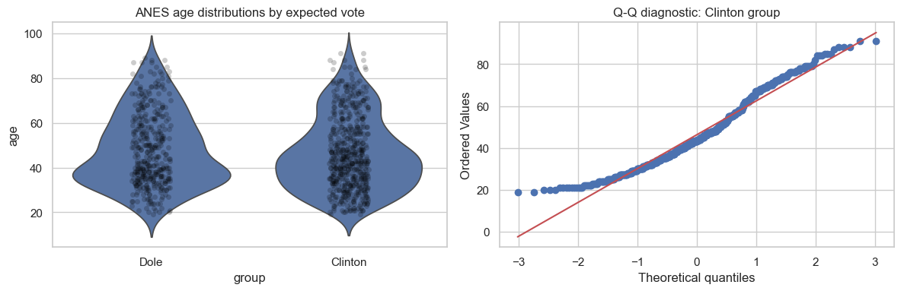

# Lesson 4: Two Independent Groups

> **Authoritative lesson:** This Markdown file is the maintained teaching source. The notebook is a supporting,
> executable example and should not be used to overwrite this lesson.

## Lesson overview

Independent-group methods compare outcomes from different observational units assigned to or sampled into two groups.

### Why this matters

They are the standard tools for parallel experiments and independent observational comparisons.

### Prerequisites

Lessons 1–3, independent sampling, means, variances, and confidence intervals.

## Learning objectives

1. Use Welch's t-test as a robust default for independent means
2. Compute a confidence interval for the mean difference and Hedges' g
3. Use Mann–Whitney U for ordinal or rank-focused questions
4. Explain why test choice depends on the estimand, not only a normality p-value

## Concept map

The lesson covers the following concepts explicitly.

| Concept | Meaning | Teaching section |
|---|---|---|
| Independent design and estimand | Identify the independent unit and the group contrast of interest. | [4.1 Design and estimand](#41-design-and-estimand) |
| Welch's t-test | Compare means without assuming equal variances. | [4.1 Design and estimand](#41-design-and-estimand) |
| Welch–Satterthwaite degrees of freedom | Approximate degrees of freedom under unequal standard errors. | [4.1 Design and estimand](#41-design-and-estimand) |
| Mean-difference confidence interval | Express uncertainty in the original outcome units. | [4.1 Design and estimand](#41-design-and-estimand) |
| Cohen's d and Hedges' g | Standardized effects with a small-sample correction. | [4.1 Design and estimand](#41-design-and-estimand) |
| Distribution diagnostics | Violin, strip, and Q-Q plots expose shape and influential values. | [4.1 Design and estimand](#41-design-and-estimand) |
| Mann–Whitney U | Rank-based contrast for independent groups. | [4.1 Design and estimand](#41-design-and-estimand) |
| Rank-biserial correlation | Effect size derived from the U statistic with direction set by group order. | [4.1 Design and estimand](#41-design-and-estimand) |

## Data used in this lesson

The examples use the local, documented real-data bundle. See the [dataset guide](../../data/readme.md) for provenance,
variable definitions, cleaning decisions, and reuse notes.

| Dataset | Observation unit | Lesson use | Interpretation boundary |
|---|---|---|---|
| ANES 1996 | one survey respondent | Age is compared between respondents expecting to vote for Dole and Clinton. | Vote groups were observed, not randomly assigned; inference is associational. |

## Notebook setup

The examples use the shared scientific-Python setup described in the
[Notebook Implementation Toolkit](../../docs/maintenance/notebook_toolkit.md). That reference explains imports, deterministic random-number
generation, plotting configuration, output behavior, and why global warning suppression is discouraged.

## 4.1 Design and estimand

Two independent groups contain different observational units. Welch's t-test targets a difference in
population means without assuming equal variances. It is generally a safer default than the pooled
equal-variance t-test.

Mann–Whitney U tests a rank/distributional contrast. Interpreting it as a median test requires similar
distribution shapes; it is not automatically a drop-in test of means.


```python
anes = pd.read_csv(DATA_DIR / "anes96_clean.csv")
clinton = anes.loc[anes["expected_vote"] == "Clinton", "age_years"].to_numpy()
dole = anes.loc[anes["expected_vote"] == "Dole", "age_years"].to_numpy()

welch = stats.ttest_ind(dole, clinton, equal_var=False)
n1, n2 = len(dole), len(clinton)
m1, m2 = dole.mean(), clinton.mean()
v1, v2 = dole.var(ddof=1), clinton.var(ddof=1)
se = np.sqrt(v1/n1 + v2/n2)
df = (v1/n1 + v2/n2)**2 / ((v1/n1)**2/(n1-1) + (v2/n2)**2/(n2-1))
diff = m1-m2
ci = diff + np.array([-1, 1])*stats.t.ppf(.975, df)*se
pooled_sd = np.sqrt(((n1-1)*v1+(n2-1)*v2)/(n1+n2-2))
d = diff/pooled_sd
hedges_g = (1-3/(4*(n1+n2)-9))*d

pd.Series({"Dole mean age": m1, "Clinton mean age": m2, "difference": diff,
           "95% CI low": ci[0], "95% CI high": ci[1], "Welch t": welch.statistic,
           "df": df, "p": welch.pvalue, "Hedges g": hedges_g})

```


    Dole mean age        48.0865
    Clinton mean age     46.2995
    difference            1.7871
    95% CI low           -0.3400
    95% CI high           3.9141
    Welch t               1.6491
    df                  843.5343
    p                     0.0995
    Hedges g              0.1088
    dtype: float64


```python
tidy = anes[["age_years", "expected_vote"]].rename(
    columns={"age_years": "age", "expected_vote": "group"})
fig, axes = plt.subplots(1, 2, figsize=(12, 4))
sns.violinplot(data=tidy, x="group", y="age", inner=None, ax=axes[0])
sns.stripplot(data=tidy, x="group", y="age", color="black", alpha=.2, ax=axes[0])
axes[0].set_title("ANES age distributions by expected vote")
stats.probplot(clinton, dist="norm", plot=axes[1])
axes[1].set_title("Q-Q diagnostic: Clinton group")
plt.tight_layout(); plt.show()

```

    /Users/soroush/Library/Python/3.9/lib/python/site-packages/seaborn/_base.py:948: FutureWarning: When grouping with a length-1 list-like, you will need to pass a length-1 tuple to get_group in a future version of pandas. Pass `(name,)` instead of `name` to silence this warning.
      data_subset = grouped_data.get_group(pd_key)
    /Users/soroush/Library/Python/3.9/lib/python/site-packages/seaborn/_base.py:948: FutureWarning: When grouping with a length-1 list-like, you will need to pass a length-1 tuple to get_group in a future version of pandas. Pass `(name,)` instead of `name` to silence this warning.
      data_subset = grouped_data.get_group(pd_key)
    /Users/soroush/Library/Python/3.9/lib/python/site-packages/seaborn/_base.py:948: FutureWarning: When grouping with a length-1 list-like, you will need to pass a length-1 tuple to get_group in a future version of pandas. Pass `(name,)` instead of `name` to silence this warning.
      data_subset = grouped_data.get_group(pd_key)


    

    


```python
mw = stats.mannwhitneyu(dole, clinton, alternative="two-sided")
rank_biserial = 2*mw.statistic/(n1*n2)-1
pd.Series({"U": mw.statistic, "p": mw.pvalue,
           "rank-biserial correlation (Dole-Clinton)": rank_biserial,
           "Dole median age": np.median(dole),
           "Clinton median age": np.median(clinton)})

```


    U                                           114961.5000
    p                                                0.1052
    rank-biserial correlation (Dole-Clinton)         0.0618
    Dole median age                                 45.0000
    Clinton median age                              43.0000
    dtype: float64


## Worked example and interpretation

### How the groups are compared

The ANES example defines two non-overlapping respondent groups by expected vote and measures age, with every respondent counted once. Welch's test estimates the **Dole minus Clinton** mean-age difference without requiring equal group variances. The sample means are 48.09 and 46.30 years, respectively, giving a difference of 1.79 years. Its 95% interval runs from −0.34 to 3.91 years and the p-value is 0.0995; Hedges' g is 0.109. The interval includes zero and effects in both directions, so the data do not pin down a reliable mean difference at the 0.05 threshold. The violin/point display and Q–Q diagnostic help inspect distribution shape and outliers.

### Why the rank analysis is separate

The notebook also calculates Mann–Whitney U, with p = 0.105 and rank-biserial correlation 0.062. The group medians are 45 and 43 years. This method compares relative ordering of observations; it is not automatically a test of median equality when distribution shapes differ. Both analyses are observational comparisons. Expected-vote groups were not randomized, so even a clear age difference would not show that vote preference caused age to change.

## Practice and solution

**Practice.** Why is selecting Welch versus Mann–Whitney solely from a Shapiro–Wilk p-value weak?

<details><summary>Solution</summary>

The tests target different quantities. Normality tests have low power in small samples and excessive
sensitivity in large samples. Use the scientific estimand, design, plots, outlier influence, and sample
size. Welch's test is often robust for means; Mann–Whitney is natural for ordinal outcomes or a
probability-of-superiority/rank contrast.
</details>

## Summary

- Verify independence from the design.
- Prefer Welch for an independent mean difference unless equal-variance pooling is justified.
- Report the raw-unit difference and CI alongside a standardized effect.


## Reproducibility checklist

- State the population, outcome, groups, and sampling unit.
- State $H_0$, $H_1$, alpha, and whether the test is one- or two-sided before looking at results.
- Verify independence from the design; use plots and diagnostics for distributional assumptions.
- Report the estimate, confidence interval, effect size, test statistic, degrees of freedom, and exact p-value.
- Separate statistical evidence from practical importance and acknowledge design limitations.

## Implementation reference

These APIs and code patterns are demonstrated in the supporting notebook.

| API or pattern | Purpose | Usage guidance |
|---|---|---|
| `scipy.stats.ttest_ind(..., equal_var=False)` | Run Welch's test. | Use `equal_var=True` only when pooled variance is substantively justified. |
| `scipy.stats.t.ppf` | Obtain the critical value for a manually constructed interval. | Pass the calculated Welch degrees of freedom. |
| `scipy.stats.mannwhitneyu` | Run the independent rank test. | Specify `alternative` and document group order. |
| `seaborn.violinplot` and `stripplot` | Show shape and observations together. | Avoid hiding small samples behind only a smooth density. |

## Best practices

- Use Welch's test as the default mean comparison.
- Choose a rank test because its estimand fits—not merely because a normality p-value is small.
- Name the subtraction direction for every effect.

## Common mistakes and edge cases

- Treating repeated observations from one person as independent.
- Interpreting Mann–Whitney as a median test when group shapes differ.
- Reporting only a standardized effect when original units drive decisions.

## Additional practice

1. Compare the estimands of Welch and Mann–Whitney for skewed groups.
2. Explain how reversing treatment and control changes the sign of the reported effects.

## Related lessons and source material

- **Previous:** [Lesson 03 One-Sample Tests for Means and Proportions](lesson_03_one_sample_tests_for_means_and_proportions.md)
- **Next:** [Lesson 05 Paired and Repeated Measurements](lesson_05_paired_and_repeated_measurements.md)
- **Supporting notebook:** [lesson_04_two_independent_groups.ipynb](../lesson_04_two_independent_groups.ipynb)
- **Coverage record:** [Course Coverage Index](../../docs/maintenance/course_coverage_index.md#lesson-4-two-independent-groups)
