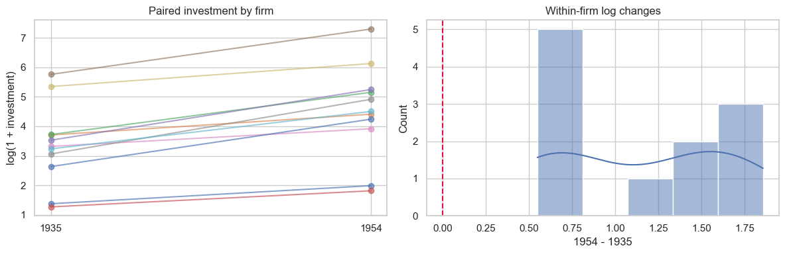

# Lesson 5: Paired and Repeated Measurements

> **Authoritative lesson:** This Markdown file is the maintained teaching source. The notebook is a supporting,
> executable example and should not be used to overwrite this lesson.

## Lesson overview

Paired methods preserve the link between repeated or matched observations and analyze within-pair information.

### Why this matters

Correct pairing removes between-unit noise and prevents false precision from pretending repeated measurements are independent.

### Prerequisites

Lesson 4 plus differences, matched designs, and binary contingency tables.

## Learning objectives

1. Recognize paired, matched, and repeated-measures designs
2. Analyze paired quantitative outcomes using the distribution of within-pair differences
3. Use Wilcoxon signed-rank and McNemar tests when their data structures match
4. Avoid treating repeated observations as independent

## Concept map

The lesson covers the following concepts explicitly.

| Concept | Meaning | Teaching section |
|---|---|---|
| Paired design and unit of analysis | The pair or subject—not each row independently—is the inferential unit. | [5.1 Pairing changes the unit of analysis](#51-pairing-changes-the-unit-of-analysis) |
| Paired t-test | One-sample t-test applied to within-pair differences. | [5.1 Pairing changes the unit of analysis](#51-pairing-changes-the-unit-of-analysis) |
| Change-score confidence interval | Estimate mean after-minus-before change. | [5.1 Pairing changes the unit of analysis](#51-pairing-changes-the-unit-of-analysis) |
| Cohen's dz | Mean change standardized by the standard deviation of changes. | [5.1 Pairing changes the unit of analysis](#51-pairing-changes-the-unit-of-analysis) |
| Paired trajectory and change plots | Show individual movement and the difference distribution. | [5.1 Pairing changes the unit of analysis](#51-pairing-changes-the-unit-of-analysis) |
| Wilcoxon signed-rank | Rank-based paired procedure with symmetry considerations. | [5.2 Rank-based and binary paired tests](#52-rank-based-and-binary-paired-tests) |
| McNemar's exact test | Test change in paired binary outcomes using discordant pairs. | [5.2 Rank-based and binary paired tests](#52-rank-based-and-binary-paired-tests) |
| Discordant-pair odds ratio | Compare No-to-Yes with Yes-to-No transitions. | [5.2 Rank-based and binary paired tests](#52-rank-based-and-binary-paired-tests) |

## Data used in this lesson

The examples use the local, documented real-data bundle. See the [dataset guide](../../data/readme.md) for provenance,
variable definitions, cleaning decisions, and reuse notes.

| Dataset | Observation unit | Lesson use | Interpretation boundary |
|---|---|---|---|
| Grunfeld investment | one firm-year | The same firms in 1935 and 1954 form genuine pairs for quantitative and derived binary comparisons. | The threshold of 25 is an explicit teaching choice, and the main analysis uses log-transformed investment. |

## Notebook setup

The examples use the shared scientific-Python setup described in the
[Notebook Implementation Toolkit](../../docs/maintenance/notebook_toolkit.md). That reference explains imports, deterministic random-number
generation, plotting configuration, output behavior, and why global warning suppression is discouraged.

## 5.1 Pairing changes the unit of analysis

The Grunfeld dataset follows the same 11 firms across years. Comparing each firm's investment in 1935 with its own
investment in 1954 creates a genuine paired design. The paired t-test is a one-sample t-test on within-firm log changes.
Its assumptions concern those changes—not the two marginal year distributions.


```python
grunfeld = pd.read_csv(DATA_DIR / "grunfeld_investment.csv")
paired = grunfeld.pivot(index="firm", columns="year", values="investment")[[1935, 1954]].dropna()
before_raw = paired[1935].to_numpy()
after_raw = paired[1954].to_numpy()
before = np.log1p(before_raw)
after = np.log1p(after_raw)
change = after-before

paired_test = stats.ttest_rel(after, before)
n = len(change)
mean_change = change.mean()
se = change.std(ddof=1)/np.sqrt(n)
ci = stats.t.interval(.95, n-1, loc=mean_change, scale=se)
dz = mean_change/change.std(ddof=1)
pd.Series({"firms": n, "mean log-investment change": mean_change,
           "CI low": ci[0], "CI high": ci[1], "t": paired_test.statistic,
           "df": n-1, "p": paired_test.pvalue, "Cohen dz": dz})

```


    firms                         1.1000e+01
    mean log-investment change    1.1528e+00
    CI low                        8.1223e-01
    CI high                       1.4934e+00
    t                             7.5422e+00
    df                            1.0000e+01
    p                             1.9655e-05
    Cohen dz                      2.2741e+00
    dtype: float64


```python
fig, axes = plt.subplots(1, 2, figsize=(12, 4))
for firm, row in paired.iterrows():
    axes[0].plot([1935, 1954], np.log1p(row.values), marker="o", alpha=.65)
axes[0].set(xticks=[1935, 1954], ylabel="log(1 + investment)",
            title="Paired investment by firm")
sns.histplot(change, kde=True, ax=axes[1])
axes[1].axvline(0, color="crimson", linestyle="--")
axes[1].set(title="Within-firm log changes", xlabel="1954 - 1935")
plt.tight_layout(); plt.show()

```


    

    


## 5.2 Rank-based and binary paired tests

- **Wilcoxon signed-rank:** paired quantitative/ordinal data; tests symmetry-centered change and assumes
  a roughly symmetric difference distribution.
- **Sign test:** weaker but needs fewer shape assumptions.
- **McNemar:** paired binary outcomes; uses only discordant pairs.


```python
wilcoxon = stats.wilcoxon(after, before, alternative="two-sided")
from statsmodels.stats.contingency_tables import mcnemar

# A simple paired binary teaching outcome: investment at least 25 (1947 dollars).
threshold = 25
high_1935 = before_raw >= threshold
high_1954 = after_raw >= threshold
paired_binary = pd.crosstab(high_1935, high_1954).reindex(
    index=[False, True], columns=[False, True], fill_value=0).to_numpy()
mc = mcnemar(paired_binary, exact=True)
b, c = paired_binary[0, 1], paired_binary[1, 0]
discordant_or = b/c if c else np.inf
display(pd.DataFrame(paired_binary, index=["1935 below", "1935 at/above"],
                     columns=["1954 below", "1954 at/above"]))
pd.DataFrame({"test": ["Wilcoxon signed-rank", "Exact McNemar"],
              "statistic": [wilcoxon.statistic, mc.statistic],
              "p": [wilcoxon.pvalue, mc.pvalue],
              "effect/note": ["paired log-investment shift", f"discordant OR={discordant_or}"]})

```


| Term | 1954 below | 1954 at/above |
|---|---|---|
| 1935 below | 2 | 3 |
| 1935 at/above | 0 | 6 |


| Term | test | statistic | p | effect/note |
|---|---|---|---|---|
| 0 | Wilcoxon signed-rank | 0 | 0.001 | paired log-investment shift |
| 1 | Exact McNemar | 0 | 0.25 | discordant OR=inf |


## Worked example and interpretation

### Preserve the pairing

The Grunfeld example keeps firms observed in both 1935 and 1954, leaving 11 independent **firm pairs**, not 22 independent rows. It applies log(1 + investment) to each year and analyzes each firm's later-minus-earlier change. The mean paired log change is 1.153 with a 95% interval from 0.812 to 1.493; the paired t statistic is 7.54 on 10 degrees of freedom, with p about 0.00002. The connected-firm plot shows the matched trajectories, and the change histogram shows what the paired test summarizes. A Wilcoxon signed-rank test of those paired changes also gives evidence of a shift (p = 0.001), with different rank-based assumptions.

### Why the binary result differs

The same investments are then reduced to whether each firm meets a threshold of 25. Three firms move from below to at/above the threshold and none move the other way. Exact McNemar uses only these **three discordant pairs** and gives p = 0.25. The displayed discordant odds ratio is infinite solely because one cell is zero; it is not a precise effect estimate. The continuous and thresholded analyses answer different questions, and historical changes between years cannot be attributed to a treatment from this before-and-after design.

## Practice and solution

**Practice.** A dataset has three measurements per participant. Why not run three independent t-tests?

<details><summary>Solution</summary>

Measurements within a person are correlated, violating independence, and three tests inflate the
family-wise error rate. Use repeated-measures ANOVA, Friedman, or a mixed model, followed by adjusted
planned contrasts when needed.
</details>

## Summary

- Pairing must be represented in both plots and tests.
- Diagnose the within-pair differences for a paired t-test.
- McNemar is for paired binary outcomes, not independent contingency tables.


## Reproducibility checklist

- State the population, outcome, groups, and sampling unit.
- State $H_0$, $H_1$, alpha, and whether the test is one- or two-sided before looking at results.
- Verify independence from the design; use plots and diagnostics for distributional assumptions.
- Report the estimate, confidence interval, effect size, test statistic, degrees of freedom, and exact p-value.
- Separate statistical evidence from practical importance and acknowledge design limitations.

## Implementation reference

These APIs and code patterns are demonstrated in the supporting notebook.

| API or pattern | Purpose | Usage guidance |
|---|---|---|
| `scipy.stats.ttest_rel` | Run a paired t-test. | Input arrays must be aligned in the same subject order. |
| `scipy.stats.wilcoxon` | Run the signed-rank test. | Zero differences and ties require attention. |
| `statsmodels.stats.contingency_tables.mcnemar` | Run approximate or exact McNemar inference. | Use exact inference when discordant counts are small. |
| `Axes.plot` over paired points | Draw subject-level trajectories. | This reveals heterogeneous responses hidden by mean summaries. |
| `DataFrame.pivot` | Align each firm's 1935 and 1954 observations. | Verify one value per firm-year before pivoting. |
| `numpy.log1p` | Reduce investment skew while retaining zeros. | Interpret the resulting contrast on the log scale. |
| `pandas.crosstab` | Create the paired binary transition table. | Retain the same firm ordering in both periods. |

## Best practices

- Verify pair identifiers and ordering before analysis.
- Diagnose the distribution of differences for the paired t-test.
- Report discordant counts for McNemar, not only the p-value.

## Common mistakes and edge cases

- Applying an independent t-test to paired observations.
- Checking normality separately for before and after instead of changes.
- Using McNemar for independent 2x2 groups.

## Additional practice

1. Construct the four-cell McNemar table from paired binary records.
2. Explain when a mixed model is preferable to a paired test.

## Related lessons and source material

- **Previous:** [Lesson 04 Two Independent Groups](lesson_04_two_independent_groups.md)
- **Next:** [Lesson 06 Three or More Independent Groups](../../level_2_applied_testing/markdown/lesson_06_three_or_more_independent_groups.md)
- **Supporting notebook:** [lesson_05_paired_and_repeated_measurements.ipynb](../lesson_05_paired_and_repeated_measurements.ipynb)
- **Coverage record:** [Course Coverage Index](../../docs/maintenance/course_coverage_index.md#lesson-5-paired-and-repeated-measurements)
