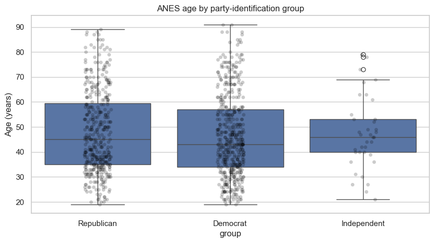

# Lesson 6: Three or More Independent Groups

> **Authoritative lesson:** This Markdown file is the maintained teaching source. The notebook is a supporting,
> executable example and should not be used to overwrite this lesson.

## Lesson overview

Omnibus multi-group tests ask whether any population group differs before locating specific contrasts.

### Why this matters

They avoid a collection of unadjusted pairwise tests and provide a principled path to post-hoc analysis.

### Prerequisites

Independent two-group inference, variance, regression basics, and multiplicity awareness.

## Learning objectives

1. Run one-way ANOVA and quantify the omnibus effect with omega-squared
2. Use Welch ANOVA or Kruskal–Wallis when appropriate
3. Follow a significant omnibus test with multiplicity-aware comparisons
4. Distinguish planned contrasts from exploratory post-hoc testing

## Concept map

The lesson covers the following concepts explicitly.

| Concept | Meaning | Teaching section |
|---|---|---|
| One-way ANOVA | Compare three or more independent means with an omnibus F test. | [6.1 The omnibus question](#61-the-omnibus-question) |
| OLS formula representation | Fit ANOVA as `score ~ C(group)`. | [6.1 The omnibus question](#61-the-omnibus-question) |
| ANOVA table | Partition sums of squares into group and residual components. | [6.1 The omnibus question](#61-the-omnibus-question) |
| Omega-squared | Less biased omnibus effect-size estimate than eta-squared. | [6.1 The omnibus question](#61-the-omnibus-question) |
| Tukey HSD | Multiplicity-controlled all-pairs comparisons after ANOVA. | [6.1 The omnibus question](#61-the-omnibus-question) |
| Welch ANOVA | Omnibus mean comparison for unequal variances. | [6.2 Robust alternatives](#62-robust-alternatives) |
| Kruskal–Wallis and epsilon-squared | Rank-based omnibus test and effect size. | [6.2 Robust alternatives](#62-robust-alternatives) |
| Pairwise Mann–Whitney with Holm | Follow-up rank comparisons with family-wise error control. | [6.2 Robust alternatives](#62-robust-alternatives) |
| Planned contrasts versus post-hoc tests | Separate targeted hypotheses from exploratory all-pairs searches. | [Practice and solution](#practice-and-solution) |

## Data used in this lesson

The examples use the local, documented real-data bundle. See the [dataset guide](../../data/readme.md) for provenance,
variable definitions, cleaning decisions, and reuse notes.

| Dataset | Observation unit | Lesson use | Interpretation boundary |
|---|---|---|---|
| ANES 1996 | one survey respondent | Age is compared across three party-identification groups. | The groups are observational; omnibus and post-hoc results do not establish causal party effects. |

## Notebook setup

The examples use the shared scientific-Python setup described in the
[Notebook Implementation Toolkit](../../docs/maintenance/notebook_toolkit.md). That reference explains imports, deterministic random-number
generation, plotting configuration, output behavior, and why global warning suppression is discouraged.

## 6.1 The omnibus question

One-way ANOVA tests $H_0:\mu_1=\cdots=\mu_k$. Rejection means at least one mean differs; it does not say
which. The F statistic compares between-group variation with within-group variation. Independence is a
design assumption; residual shape and variance patterns are model diagnostics.


```python
anes = pd.read_csv(DATA_DIR / "anes96_clean.csv")
df = anes[["party_group", "age_years"]].dropna().rename(
    columns={"party_group": "group", "age_years": "score"})
groups = {name: part["score"].to_numpy() for name, part in df.groupby("group", observed=True)}

from statsmodels.formula.api import ols
from statsmodels.stats.anova import anova_lm
model = ols("score ~ C(group)", data=df).fit()
table = anova_lm(model, typ=2)
ss_between = table.loc["C(group)", "sum_sq"]
ss_error = table.loc["Residual", "sum_sq"]
df_between = table.loc["C(group)", "df"]
ms_error = ss_error/table.loc["Residual", "df"]
omega2 = (ss_between-df_between*ms_error)/(ss_between+ss_error+ms_error)
display(table)
print(f"Omega-squared: {omega2:.3f}")

```


| Term | sum_sq | df | F | PR(>F) |
|---|---|---|---|---|
| C(group) | 417.3 | 2 | 0.7732 | 0.4618 |
| Residual | 2.539e+05 | 941 |  |  |


    Omega-squared: -0.000


```python
from statsmodels.stats.multicomp import pairwise_tukeyhsd
tukey = pairwise_tukeyhsd(df["score"], df["group"], alpha=.05)
print(tukey)

fig, ax = plt.subplots()
sns.boxplot(data=df, x="group", y="score", ax=ax)
sns.stripplot(data=df, x="group", y="score", color="black", alpha=.2, ax=ax)
ax.set(title="ANES age by party-identification group", ylabel="Age (years)")
plt.show()

```

         Multiple Comparison of Means - Tukey HSD, FWER=0.05     
    =============================================================
       group1      group2   meandiff p-adj   lower  upper  reject
    -------------------------------------------------------------
       Democrat Independent   0.9186 0.9424 -5.6568  7.494  False
       Democrat  Republican   1.3556 0.4304 -1.2127 3.9239  False
    Independent  Republican    0.437 0.9868 -6.1764 7.0504  False
    -------------------------------------------------------------


    /Users/soroush/Library/Python/3.9/lib/python/site-packages/seaborn/categorical.py:632: FutureWarning: SeriesGroupBy.grouper is deprecated and will be removed in a future version of pandas.
      positions = grouped.grouper.result_index.to_numpy(dtype=float)
    /Users/soroush/Library/Python/3.9/lib/python/site-packages/seaborn/_base.py:948: FutureWarning: When grouping with a length-1 list-like, you will need to pass a length-1 tuple to get_group in a future version of pandas. Pass `(name,)` instead of `name` to silence this warning.
      data_subset = grouped_data.get_group(pd_key)


    

    


## 6.2 Robust alternatives

- **Welch ANOVA:** compares means with unequal variances; follow with Games–Howell when available.
- **Kruskal–Wallis:** rank-based omnibus test for independent groups; follow with adjusted pairwise
  rank tests. It is sensitive to distributional differences, not exclusively medians.


```python
from statsmodels.stats.oneway import anova_oneway
from statsmodels.stats.multitest import multipletests
from itertools import combinations

welch = anova_oneway(list(groups.values()), use_var="unequal")
kw = stats.kruskal(*groups.values())
n_total, k = len(df), len(groups)
epsilon2 = max(0, (kw.statistic-k+1)/(n_total-k))

comparisons = []
for a, b in combinations(groups, 2):
    result = stats.mannwhitneyu(groups[a], groups[b], alternative="two-sided")
    comparisons.append([a, b, result.statistic, result.pvalue])
comp = pd.DataFrame(comparisons, columns=["group 1", "group 2", "U", "raw p"])
comp["Holm p"] = multipletests(comp["raw p"], method="holm")[1]
print(f"Welch ANOVA: F={welch.statistic:.3f}, p={welch.pvalue:.4g}")
print(f"Kruskal-Wallis: H={kw.statistic:.3f}, p={kw.pvalue:.4g}, epsilon²={epsilon2:.3f}")
comp

```

    Welch ANOVA: F=0.764, p=0.4686
    Kruskal-Wallis: H=1.628, p=0.4432, epsilon²=0.000


| Term | group 1 | group 2 | U | raw p | Holm p |
|---|---|---|---|---|---|
| 0 | Democrat | Independent | 8438 | 0.5078 | 1 |
| 1 | Democrat | Republican | 9.756e+04 | 0.2343 | 0.7028 |
| 2 | Independent | Republican | 7922 | 0.8254 | 1 |


## Worked example and interpretation

### Global and pairwise questions

The ANES example groups respondent ages by three party-identification categories. A one-way ANOVA asks whether all population group means could be equal; it gives F = 0.773 and p = 0.462. The estimated omega-squared is essentially zero (a slightly negative sample estimate is conventionally read as no detectable explained variation). This global result does not identify any particular pair. Tukey's adjusted pairwise comparisons all retain zero in their intervals, matching the weak omnibus evidence. The box-and-point chart shows the distributions behind the summary.

### Sensitivity to assumptions

The notebook repeats the global question with Welch ANOVA, which allows unequal variances (p = 0.469), and Kruskal–Wallis, which uses ranks (p = 0.443). Holm-adjusted rank comparisons also show no clear pairwise difference. Agreement here strengthens the limited conclusion that this dataset gives little evidence of age differences by party category; it does **not** prove the group distributions are identical. Test choice still depends on the estimand, independent respondent sampling, variance pattern, shape, and whether ranks or means answer the research question.

## Practice and solution

**Practice.** The omnibus ANOVA p-value is .002. Can you report that group C exceeds group A?

<details><summary>Solution</summary>

Not from the omnibus result alone. Use a pre-specified contrast or a multiplicity-controlled post-hoc
comparison and report the estimated difference with its interval. The omnibus test only establishes
that not all population means are equal.
</details>

## Summary

- Omnibus tests answer a global question; post-hoc tests locate differences.
- Use omega-squared or another effect size, not only F and p.
- Choose robust methods based on the estimand and diagnostics.


## Reproducibility checklist

- State the population, outcome, groups, and sampling unit.
- State $H_0$, $H_1$, alpha, and whether the test is one- or two-sided before looking at results.
- Verify independence from the design; use plots and diagnostics for distributional assumptions.
- Report the estimate, confidence interval, effect size, test statistic, degrees of freedom, and exact p-value.
- Separate statistical evidence from practical importance and acknowledge design limitations.

## Implementation reference

These APIs and code patterns are demonstrated in the supporting notebook.

| API or pattern | Purpose | Usage guidance |
|---|---|---|
| `statsmodels.formula.api.ols` | Fit the linear model behind ANOVA. | `C(group)` marks the predictor as categorical. |
| `statsmodels.stats.anova.anova_lm` | Produce the ANOVA decomposition. | Document the chosen sum-of-squares type. |
| `pairwise_tukeyhsd` | Run Tukey's all-pairs procedure. | Use after an appropriate omnibus/model analysis. |
| `statsmodels.stats.oneway.anova_oneway(use_var='unequal')` | Run Welch ANOVA. | Useful when variances differ. |
| `scipy.stats.kruskal` | Run Kruskal–Wallis. | A significant result is not automatically a pure median difference. |
| `multipletests(..., method='holm')` | Adjust pairwise p-values. | Holm controls family-wise error and dominates simple Bonferroni. |
| `itertools.combinations` | Generate each unique group pair. | Keep the hypothesis family explicit. |

## Best practices

- Inspect distributions and residuals before interpreting the omnibus table.
- Report omega-squared and group summaries.
- Use post-hoc procedures that match the omnibus model.

## Common mistakes and edge cases

- Inferring a particular pair difference from only the omnibus p-value.
- Running every pair at alpha .05 without correction.
- Interpreting a rank test as if it necessarily compared means.

## Additional practice

1. Choose between standard ANOVA, Welch ANOVA, and Kruskal–Wallis for three scenarios.
2. Write a planned contrast that compares one treatment with the average of two controls.

## Related lessons and source material

- **Previous:** [Lesson 05 Paired and Repeated Measurements](../../level_1_foundations/markdown/lesson_05_paired_and_repeated_measurements.md)
- **Next:** [Lesson 07 Factorial Designs Interactions and ANCOVA](lesson_07_factorial_designs_interactions_and_ancova.md)
- **Supporting notebook:** [lesson_06_three_or_more_independent_groups.ipynb](../lesson_06_three_or_more_independent_groups.ipynb)
- **Coverage record:** [Course Coverage Index](../../docs/maintenance/course_coverage_index.md#lesson-6-three-or-more-independent-groups)
