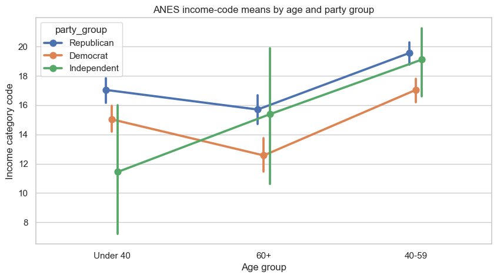

# Lesson 7: Factorial Designs, Interactions, and ANCOVA

> **Authoritative lesson:** This Markdown file is the maintained teaching source. The notebook is a supporting,
> executable example and should not be used to overwrite this lesson.

## Lesson overview

Factorial models estimate main effects and interactions; ANCOVA adds quantitative covariates to improve precision or adjust comparisons.

### Why this matters

Many real questions involve effect modification or baseline differences that a one-factor test cannot represent.

### Prerequisites

Lesson 6, linear-model notation, categorical coding, and confidence intervals.

## Learning objectives

1. Interpret an interaction before interpreting main effects
2. Fit a two-factor model and test model terms
3. Use ANCOVA to improve precision while checking slope homogeneity
4. Explain why post-treatment covariate adjustment can bias results

## Concept map

The lesson covers the following concepts explicitly.

| Concept | Meaning | Teaching section |
|---|---|---|
| Factorial design | Study two categorical factors in one model. | [7.1 Factorial designs](#71-factorial-designs) |
| Interaction | The effect of one factor changes across levels of another. | [7.1 Factorial designs](#71-factorial-designs) |
| Formula interaction syntax | `C(party_group) * C(age_group)` expands main effects and their interaction. | [7.1 Factorial designs](#71-factorial-designs) |
| Type II ANOVA | Test model terms after accounting for the other main effect. | [7.1 Factorial designs](#71-factorial-designs) |
| Interaction plot | Display cell means and intervals to interpret effect modification. | [7.1 Factorial designs](#71-factorial-designs) |
| ANCOVA | Compare groups while adjusting for a pre-treatment continuous covariate. | [7.2 ANCOVA](#72-ancova) |
| Homogeneity of regression slopes | Check group-by-covariate interaction before using a common slope. | [7.2 ANCOVA](#72-ancova) |
| Adjusted coefficients | Interpret group effects conditional on the modeled covariate. | [7.2 ANCOVA](#72-ancova) |
| Post-treatment adjustment bias | Do not condition on variables caused by treatment without a causal rationale. | [7.2 ANCOVA](#72-ancova) |

## Data used in this lesson

The examples use the local, documented real-data bundle. See the [dataset guide](../../data/readme.md) for provenance,
variable definitions, cleaning decisions, and reuse notes.

| Dataset | Observation unit | Lesson use | Interpretation boundary |
|---|---|---|---|
| ANES 1996 | one survey respondent | Income category is modeled by age and party group; TV-news use is modeled by vote group with age adjustment. | Both models describe adjusted associations, not randomized effects. |

## Notebook setup

The examples use the shared scientific-Python setup described in the
[Notebook Implementation Toolkit](../../docs/maintenance/notebook_toolkit.md). That reference explains imports, deterministic random-number
generation, plotting configuration, output behavior, and why global warning suppression is discouraged.

## 7.1 Factorial designs

The ANES example studies household-income category across age and party-identification groups. This is an observational
factorial analysis: interactions describe association patterns and must not be interpreted as randomized effects.

A two-factor model includes main effects and an interaction:
$$Y=\beta_0+\beta_A A+\beta_B B+\beta_{AB}(A\times B)+\varepsilon.$$
A meaningful interaction says the association with one factor depends on the level of the other.


```python
anes = pd.read_csv(DATA_DIR / "anes96_clean.csv")
factorial = anes[["income_code", "party_group", "age_group"]].dropna()

from statsmodels.formula.api import ols
from statsmodels.stats.anova import anova_lm
fit = ols("income_code ~ C(party_group) * C(age_group)", data=factorial).fit()
anova_lm(fit, typ=2)

```


| Term | sum_sq | df | F | PR(>F) |
|---|---|---|---|---|
| C(party_group) | 1372 | 2 | 21.59 | 6.815e-10 |
| C(age_group) | 2508 | 2 | 39.48 | 3.464e-17 |
| C(party_group):C(age_group) | 245.9 | 4 | 1.935 | 0.1025 |
| Residual | 2.97e+04 | 935 |  |  |


```python
means = factorial.groupby(["party_group", "age_group"], observed=True,
                           as_index=False)["income_code"].mean()
fig, ax = plt.subplots()
sns.pointplot(data=factorial, x="age_group", y="income_code", hue="party_group",
              errorbar=("ci", 95), dodge=.08, ax=ax)
ax.set(title="ANES income-code means by age and party group",
       xlabel="Age group", ylabel="Income category code")
plt.show()
means

```

    /Users/soroush/Library/Python/3.9/lib/python/site-packages/seaborn/_base.py:948: FutureWarning: When grouping with a length-1 list-like, you will need to pass a length-1 tuple to get_group in a future version of pandas. Pass `(name,)` instead of `name` to silence this warning.
      data_subset = grouped_data.get_group(pd_key)
    /Users/soroush/Library/Python/3.9/lib/python/site-packages/seaborn/categorical.py:1200: FutureWarning: DataFrameGroupBy.apply operated on the grouping columns. This behavior is deprecated, and in a future version of pandas the grouping columns will be excluded from the operation. Either pass `include_groups=False` to exclude the groupings or explicitly select the grouping columns after groupby to silence this warning.
      sub_data
    /Users/soroush/Library/Python/3.9/lib/python/site-packages/seaborn/_base.py:948: FutureWarning: When grouping with a length-1 list-like, you will need to pass a length-1 tuple to get_group in a future version of pandas. Pass `(name,)` instead of `name` to silence this warning.
      data_subset = grouped_data.get_group(pd_key)
    /Users/soroush/Library/Python/3.9/lib/python/site-packages/seaborn/categorical.py:1200: FutureWarning: DataFrameGroupBy.apply operated on the grouping columns. This behavior is deprecated, and in a future version of pandas the grouping columns will be excluded from the operation. Either pass `include_groups=False` to exclude the groupings or explicitly select the grouping columns after groupby to silence this warning.
      sub_data
    /Users/soroush/Library/Python/3.9/lib/python/site-packages/seaborn/_base.py:948: FutureWarning: When grouping with a length-1 list-like, you will need to pass a length-1 tuple to get_group in a future version of pandas. Pass `(name,)` instead of `name` to silence this warning.
      data_subset = grouped_data.get_group(pd_key)
    /Users/soroush/Library/Python/3.9/lib/python/site-packages/seaborn/categorical.py:1200: FutureWarning: DataFrameGroupBy.apply operated on the grouping columns. This behavior is deprecated, and in a future version of pandas the grouping columns will be excluded from the operation. Either pass `include_groups=False` to exclude the groupings or explicitly select the grouping columns after groupby to silence this warning.
      sub_data


    

    


| Term | party_group | age_group | income_code |
|---|---|---|---|
| 0 | Democrat | 40-59 | 17.03 |
| 1 | Democrat | 60+ | 12.56 |
| 2 | Democrat | Under 40 | 15.03 |
| 3 | Independent | 40-59 | 19.1 |
| 4 | Independent | 60+ | 15.38 |
| 5 | Independent | Under 40 | 11.44 |
| 6 | Republican | 40-59 | 19.56 |
| 7 | Republican | 60+ | 15.7 |
| 8 | Republican | Under 40 | 17.04 |


## 7.2 ANCOVA

The ANES ANCOVA models weekly TV-news viewing by expected vote while adjusting for age. Because ANES is observational,
the adjusted coefficient is an association, not a treatment effect. The group-by-age interaction checks whether a common
age slope is reasonable before fitting the simpler adjusted model.


```python
ancova_df = anes[["expected_vote", "age_years", "tv_news_days_per_week"]].dropna()
slope_check = ols("tv_news_days_per_week ~ age_years * C(expected_vote)", data=ancova_df).fit()
adjusted = ols("tv_news_days_per_week ~ age_years + C(expected_vote)", data=ancova_df).fit()
print("Slope-homogeneity model:")
display(anova_lm(slope_check, typ=2))
print()
print("Adjusted observational model coefficients:")
display(adjusted.summary2().tables[1])

```

    Slope-homogeneity model:


| Term | sum_sq | df | F | PR(>F) |
|---|---|---|---|---|
| C(expected_vote) | 8.982 | 1 | 1.502 | 0.2206 |
| age_years | 1137 | 1 | 190.2 | 1.557e-39 |
| age_years:C(expected_vote) | 0.321 | 1 | 0.0537 | 0.8168 |
| Residual | 5620 | 940 |  |  |


    
    Adjusted observational model coefficients:


| Term | Coef. | Std.Err. | t | P>|t| | [0.025 | 0.975] |
|---|---|---|---|---|---|---|
| Intercept | 0.6603 | 0.2476 | 2.667 | 0.007797 | 0.1743 | 1.146 |
| C(expected_vote)[T.Dole] | -0.1982 | 0.1616 | -1.226 | 0.2204 | -0.5153 | 0.119 |
| age_years | 0.067 | 0.0049 | 13.8 | 1.426e-39 | 0.0574 | 0.0765 |


## Worked example and interpretation

### Factorial model

The first ANES model treats income-category code as a numeric teaching outcome and includes party group, age group, and their interaction. Party and age group have strong overall associations with the coded outcome (F = 21.59 and 39.48), while the interaction test gives F = 1.94 and p = 0.102. The cell-mean plot lets the reader inspect how each party group's profile changes across ages; visual differences between lines are not themselves an interaction test. Because income is recorded as ordered categories, a one-unit change in its code is **not** a one-unit monetary change. This linear model is exploratory and depends on how the coding is interpreted.

### Adjusted model

The ANCOVA example instead models weekly TV-news days using respondent age and expected vote. An age-by-vote interaction check gives p = 0.817, so this sample does not show clear evidence that the fitted age slope differs by vote group. In the simpler common-slope model, the estimated age coefficient is 0.067 additional TV-news days per week for each year of age, conditional on vote group. The adjusted Dole-versus-Clinton coefficient is −0.198 with p = 0.220. These are conditional **associations** in survey data, not causal effects of age or vote choice; inspect fit and residuals before using the linear approximation for prediction.

## Practice and solution

**Practice.** In a treatment-by-sex model, the interaction p-value is .01. What should be reported next?

<details><summary>Solution</summary>

Report estimated treatment effects within each sex (simple effects) with confidence intervals and a
multiplicity plan, plus an interaction plot. Avoid summarizing the result only with the overall
treatment main effect because it averages across meaningfully different effects.
</details>

## Summary

- Interactions change the meaning of main effects.
- ANCOVA can improve precision when covariates are pre-treatment and appropriately modeled.
- Model diagnostics and study design remain essential; an ANOVA table does not establish causality.


## Reproducibility checklist

- State the population, outcome, groups, and sampling unit.
- State $H_0$, $H_1$, alpha, and whether the test is one- or two-sided before looking at results.
- Verify independence from the design; use plots and diagnostics for distributional assumptions.
- Report the estimate, confidence interval, effect size, test statistic, degrees of freedom, and exact p-value.
- Separate statistical evidence from practical importance and acknowledge design limitations.

## Implementation reference

These APIs and code patterns are demonstrated in the supporting notebook.

| API or pattern | Purpose | Usage guidance |
|---|---|---|
| `ols('income_code ~ C(party_group) * C(age_group)')` | Fit the observational factorial ANES model. | The `*` operator expands to both main effects and their interaction. |
| `anova_lm(..., typ=2)` | Test factorial model terms. | Sum-of-squares choice matters in unbalanced designs. |
| `DataFrame.groupby(...).mean()` | Calculate cell means for interpretation. | Use uncertainty intervals, not means alone. |
| `seaborn.pointplot(errorbar=('ci', 95))` | Visualize interaction patterns and uncertainty. | Nonparallel lines suggest an interaction but inference comes from the model. |
| `ols('tv_news_days_per_week ~ age_years * C(expected_vote)')` | Check slope homogeneity before the simpler adjusted model. | Because the data are observational, coefficients describe adjusted associations rather than treatment effects. |

## Best practices

- Interpret meaningful interactions before averaged main effects.
- Use pre-treatment covariates selected from the design and subject matter.
- Report adjusted estimates with their reference coding.

## Common mistakes and edge cases

- Reading main effects as universal when an interaction is present.
- Adjusting for a mediator caused by treatment.
- Ignoring sum-of-squares choices in unbalanced data.

## Additional practice

1. Translate `A * B` into the model terms it creates.
2. Explain how a baseline-by-treatment interaction changes an ANCOVA interpretation.

## Related lessons and source material

- **Previous:** [Lesson 06 Three or More Independent Groups](lesson_06_three_or_more_independent_groups.md)
- **Next:** [Lesson 08 Categorical Data Chi-Square Fisher and McNemar](lesson_08_categorical_data_chi_square_fisher_and_mc_nemar.md)
- **Supporting notebook:** [lesson_07_factorial_designs_interactions_and_ancova.ipynb](../lesson_07_factorial_designs_interactions_and_ancova.ipynb)
- **Coverage record:** [Course Coverage Index](../../docs/maintenance/course_coverage_index.md#lesson-7-factorial-designs-interactions-and-ancova)
