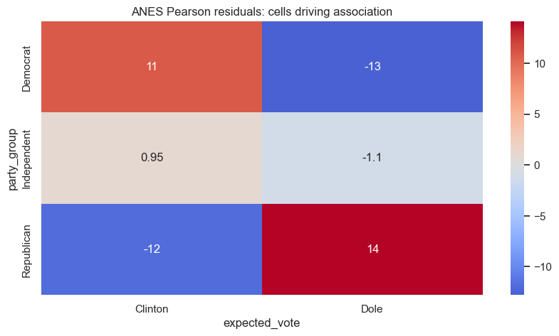

# Lesson 8: Categorical Data: Chi-Square, Fisher, and McNemar

> **Authoritative lesson:** This Markdown file is the maintained teaching source. The notebook is a supporting,
> executable example and should not be used to overwrite this lesson.

## Lesson overview

Categorical-data tests compare observed cell counts with counts expected under a probability model.

### Why this matters

They support association, goodness-of-fit, and sparse-table questions while retaining the count structure.

### Prerequisites

Probability, proportions, contingency tables, and independent versus paired designs.

## Learning objectives

1. Distinguish goodness-of-fit, independence, and paired categorical tests
2. Check expected counts and use exact methods for sparse 2x2 tables
3. Compute Cramér's V, odds ratios, and standardized residuals
4. Report counts, percentages, uncertainty, and practical meaning

## Concept map

The lesson covers the following concepts explicitly.

| Concept | Meaning | Teaching section |
|---|---|---|
| Contingency tables | Cross-classify counts for two categorical variables. | [8.1 Independence in a contingency table](#81-independence-in-a-contingency-table) |
| Expected counts under independence | Row total times column total divided by the grand total. | [8.1 Independence in a contingency table](#81-independence-in-a-contingency-table) |
| Pearson chi-square independence test | Aggregate observed-minus-expected discrepancies. | [8.1 Independence in a contingency table](#81-independence-in-a-contingency-table) |
| Degrees of freedom | Determine the chi-square reference distribution from table dimensions. | [8.1 Independence in a contingency table](#81-independence-in-a-contingency-table) |
| Cramér's V | Standardized association magnitude for contingency tables. | [8.1 Independence in a contingency table](#81-independence-in-a-contingency-table) |
| Pearson residuals | Identify cells that contribute strongly to the omnibus association. | [8.1 Independence in a contingency table](#81-independence-in-a-contingency-table) |
| Fisher's exact test | Exact conditional inference for sparse 2x2 tables. | [8.2 Sparse 2x2 tables and effect measures](#82-sparse-2x2-tables-and-effect-measures) |
| Odds ratio and confidence interval | Quantify the direction and uncertainty of a 2x2 association. | [8.2 Sparse 2x2 tables and effect measures](#82-sparse-2x2-tables-and-effect-measures) |
| Goodness-of-fit versus independence versus McNemar | Choose from one distribution, independent variables, or paired binary outcomes. | [Practice and solution](#practice-and-solution) |

## Data used in this lesson

The examples use the local, documented real-data bundle. See the [dataset guide](../../data/readme.md) for provenance,
variable definitions, cleaning decisions, and reuse notes.

| Dataset | Observation unit | Lesson use | Interpretation boundary |
|---|---|---|---|
| ANES 1996 | one survey respondent | Party identification and expected vote form the multi-category contingency table. | Association does not imply causation. |
| Spector program | one student | Program group and grade improvement provide the sparse 2x2 example. | Small samples produce wide odds-ratio intervals. |

## Notebook setup

The examples use the shared scientific-Python setup described in the
[Notebook Implementation Toolkit](../../docs/maintenance/notebook_toolkit.md). That reference explains imports, deterministic random-number
generation, plotting configuration, output behavior, and why global warning suppression is discouraged.

## 8.1 Independence in a contingency table

For cell $(i,j)$, independence implies
$$E_{ij}=\frac{(\text{row total}_i)(\text{column total}_j)}{N}.$$
The Pearson statistic $\chi^2=\sum (O-E)^2/E$ aggregates discrepancies. Inspect expected counts and
residuals; a small p-value alone does not identify the important cells.


```python
anes = pd.read_csv(DATA_DIR / "anes96_clean.csv")
table = pd.crosstab(anes["party_group"], anes["expected_vote"])
observed = table.to_numpy()
chi2, p, dof, expected = stats.chi2_contingency(observed, correction=False)
n = observed.sum()
cramer_v = np.sqrt(chi2/(n*(min(observed.shape)-1)))
residuals = (observed-expected)/np.sqrt(expected)
display(table)
print(f"chi-square({dof})={chi2:.3f}, p={p:.4g}, Cramer's V={cramer_v:.3f}")
display(pd.DataFrame(expected, index=table.index, columns=table.columns).round(2))
display(pd.DataFrame(residuals, index=table.index, columns=table.columns).round(2))

```


| ('expected_vote', 'party_group') | ('Clinton', 'Unnamed: 1_level_1') | ('Dole', 'Unnamed: 2_level_1') |
|---|---|---|
| Democrat | 467 | 21 |
| Independent | 26 | 11 |
| Republican | 58 | 361 |


    chi-square(2)=623.842, p=3.424e-136, Cramer's V=0.813


| ('expected_vote', 'party_group') | ('Clinton', 'Unnamed: 1_level_1') | ('Dole', 'Unnamed: 2_level_1') |
|---|---|---|
| Democrat | 284.8 | 203.2 |
| Independent | 21.6 | 15.4 |
| Republican | 244.6 | 174.4 |


| ('expected_vote', 'party_group') | ('Clinton', 'Unnamed: 1_level_1') | ('Dole', 'Unnamed: 2_level_1') |
|---|---|---|
| Democrat | 10.79 | -12.78 |
| Independent | 0.95 | -1.12 |
| Republican | -11.93 | 14.13 |


```python
fig, ax = plt.subplots()
sns.heatmap(pd.DataFrame(residuals, index=table.index, columns=table.columns),
            annot=True, center=0, cmap="coolwarm", ax=ax)
ax.set_title("ANES Pearson residuals: cells driving association")
plt.show()

```


    

    


## 8.2 Sparse 2x2 tables and effect measures

Fisher's exact test conditions on the margins and is valid with small counts. For a 2x2 table, report
an odds ratio and confidence interval. Relative risk is often easier to interpret in cohort or
randomized designs; odds ratios are natural in case-control studies and logistic regression.


```python
spector = pd.read_csv(DATA_DIR / "spector_program.csv")
sparse_table = pd.crosstab(spector["program_group"], spector["grade_improved"])
sparse = sparse_table.to_numpy()
fisher = stats.fisher_exact(sparse, alternative="two-sided")
from statsmodels.stats.contingency_tables import Table2x2
t22 = Table2x2(sparse)
ci = t22.oddsratio_confint()
display(sparse_table)
pd.Series({"odds ratio": fisher.statistic, "exact p": fisher.pvalue,
           "OR CI low": ci[0], "OR CI high": ci[1]})

```


| ('grade_improved', 'program_group') | ('0', 'Unnamed: 1_level_1') | ('1', 'Unnamed: 2_level_1') |
|---|---|---|
| No PSI | 15 | 3 |
| PSI | 6 | 8 |


    odds ratio     6.6667
    exact p        0.0265
    OR CI low      1.3062
    OR CI high    34.0270
    dtype: float64


## Worked example and interpretation

### Reading a contingency table

The ANES table cross-classifies party identification and expected vote for 944 respondents. The chi-square independence test compares observed counts with counts calculated from the row and column totals under independence. It gives chi-square = 623.84 on 2 degrees of freedom and p about 3.4 × 10⁻¹³⁶; Cramér's V = 0.813 describes a strong association in this table. The residual heatmap identifies influential cells: Democrat/Clinton is above its independence expectation and Republican/Dole is far above its expectation. Neither a large statistic nor a residual shows that party identification *causes* a vote choice.

### Small tables and dependence

The Spector 2×2 table contains 15/3 unimproved/improved students in the No PSI group and 6/8 in PSI. Fisher's exact test gives p = 0.0265 and an odds ratio of 6.67 for improvement under the table's orientation. The displayed 95% odds-ratio interval, 1.31 to 34.03, comes from a separate `Table2x2` calculation and is wide; do not describe it as an exact interval. Fisher applies to **independent** groups. If the same people are measured twice on a binary outcome, McNemar uses discordant pairs instead, as demonstrated with firms in Lesson 5.

## Practice and solution

**Practice.** Which test fits each case: (a) one die rolled 120 times; (b) device type versus conversion
in independent users; (c) the same users' subscription status before and after a campaign?

<details><summary>Solution</summary>

(a) Chi-square goodness-of-fit against the six expected probabilities. (b) Chi-square independence or
two-proportion test; use Fisher exact if expected counts are sparse. (c) McNemar, because outcomes are
paired binary measurements.
</details>

## Summary

- Select the categorical test from the sampling structure.
- Check expected—not observed—counts for chi-square adequacy.
- Report interpretable risks or odds with intervals, not only an association p-value.


## Reproducibility checklist

- State the population, outcome, groups, and sampling unit.
- State $H_0$, $H_1$, alpha, and whether the test is one- or two-sided before looking at results.
- Verify independence from the design; use plots and diagnostics for distributional assumptions.
- Report the estimate, confidence interval, effect size, test statistic, degrees of freedom, and exact p-value.
- Separate statistical evidence from practical importance and acknowledge design limitations.

## Implementation reference

These APIs and code patterns are demonstrated in the supporting notebook.

| API or pattern | Purpose | Usage guidance |
|---|---|---|
| `scipy.stats.chi2_contingency` | Return chi-square, p-value, degrees of freedom, and expected counts. | Set continuity correction deliberately for 2x2 tables. |
| `seaborn.heatmap` | Visualize signed cell residuals. | Use a diverging palette centered at zero. |
| `scipy.stats.fisher_exact` | Return a sample odds ratio and exact p-value for 2x2 data. | The result depends on row/column orientation. |
| `statsmodels.stats.contingency_tables.Table2x2` | Calculate odds-ratio confidence intervals and related measures. | Report the table orientation. |

## Best practices

- Display counts and percentages before the test.
- Inspect expected counts and residuals.
- Report an interpretable effect such as risk difference, relative risk, or odds ratio when design permits.

## Common mistakes and edge cases

- Using observed rather than expected counts to assess the approximation.
- Applying chi-square independence to paired observations.
- Reading an odds ratio without stating which outcome and group are in the numerator.

## Additional practice

1. Compute expected counts for a 2x3 table by hand.
2. Explain why a significant chi-square test does not identify a causal mechanism.

## Related lessons and source material

- **Previous:** [Lesson 07 Factorial Designs Interactions and ANCOVA](lesson_07_factorial_designs_interactions_and_ancova.md)
- **Next:** [Lesson 09 Proportions and A and B Tests](lesson_09_proportions_and_a_and_b_tests.md)
- **Supporting notebook:** [lesson_08_categorical_data_chi_square_fisher_and_mc_nemar.ipynb](../lesson_08_categorical_data_chi_square_fisher_and_mc_nemar.ipynb)
- **Coverage record:** [Course Coverage Index](../../docs/maintenance/course_coverage_index.md#lesson-8-categorical-data-chi-square-fisher-and-mcnemar)
