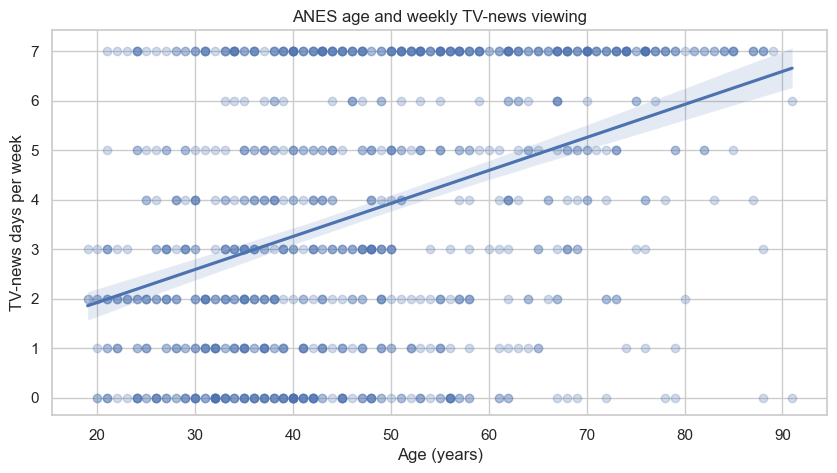
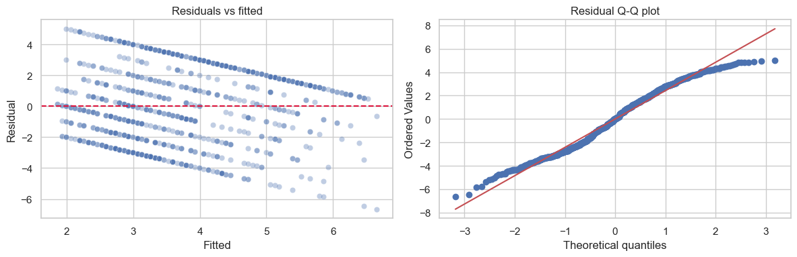

# Lesson 10: Correlation and Regression-Based Tests

> **Authoritative lesson:** This Markdown file is the maintained teaching source. The notebook is a supporting,
> executable example and should not be used to overwrite this lesson.

## Lesson overview

Correlation and regression quantify association between variables; regression additionally represents conditional mean structure.

### Why this matters

They turn vague statements about relationships into estimable coefficients with diagnostics and uncertainty.

### Prerequisites

Scatterplots, continuous variables, linear functions, and lessons on confidence intervals.

## Learning objectives

1. Select Pearson, Spearman, Kendall, or point-biserial association measures
2. Inspect form, outliers, and dependence before testing correlation
3. Test regression coefficients and interpret confidence intervals
4. Explain why association does not establish causation

## Concept map

The lesson covers the following concepts explicitly.

| Concept | Meaning | Teaching section |
|---|---|---|
| Pearson correlation | Linear association between two quantitative variables. | [10.1 Correlation is a model of association](#101-correlation-is-a-model-of-association) |
| Spearman rho | Monotonic association based on ranks. | [10.1 Correlation is a model of association](#101-correlation-is-a-model-of-association) |
| Kendall tau | Concordance-based association useful with small samples or ties. | [10.1 Correlation is a model of association](#101-correlation-is-a-model-of-association) |
| Fisher z confidence interval | Approximate interval for Pearson's correlation. | [10.1 Correlation is a model of association](#101-correlation-is-a-model-of-association) |
| Outlier sensitivity and relationship form | Raw-data plots reveal influential points, ties, discreteness, and nonlinearity. | [10.1 Correlation is a model of association](#101-correlation-is-a-model-of-association) |
| Simple OLS regression | Estimate an intercept and slope for a linear mean model. | [10.2 Regression tests](#102-regression-tests) |
| Correlation-slope equivalence | In simple regression, testing zero slope matches testing zero Pearson correlation. | [10.2 Regression tests](#102-regression-tests) |
| Residual diagnostics | Residual-versus-fitted and Q-Q plots assess model patterns. | [10.2 Regression tests](#102-regression-tests) |
| Association versus causation | Coefficients do not remove confounding by themselves. | [Practice and solution](#practice-and-solution) |

## Data used in this lesson

The examples use the local, documented real-data bundle. See the [dataset guide](../../data/readme.md) for provenance,
variable definitions, cleaning decisions, and reuse notes.

| Dataset | Observation unit | Lesson use | Interpretation boundary |
|---|---|---|---|
| ANES 1996 | one survey respondent | Age and weekly TV-news viewing illustrate correlation and simple regression. | TV-news days are discrete and the survey association is not causal. |

## Notebook setup

The examples use the shared scientific-Python setup described in the
[Notebook Implementation Toolkit](../../docs/maintenance/notebook_toolkit.md). That reference explains imports, deterministic random-number
generation, plotting configuration, output behavior, and why global warning suppression is discouraged.

## 10.1 Correlation is a model of association

Pearson's $r$ summarizes linear association; Spearman's $\rho$ summarizes monotonic rank association;
Kendall's $\tau$ is useful with small samples or many ties. Always draw the scatterplot: different
relationships can have the same correlation.


```python
anes = pd.read_csv(DATA_DIR / "anes96_clean.csv")
x = anes["age_years"].to_numpy()
y = anes["tv_news_days_per_week"].to_numpy()

pearson = stats.pearsonr(x, y)
spearman = stats.spearmanr(x, y)
kendall = stats.kendalltau(x, y)
z = np.arctanh(pearson.statistic)
se = 1/np.sqrt(len(x)-3)
r_ci = np.tanh(z + np.array([-1, 1])*stats.norm.ppf(.975)*se)
display(pd.DataFrame({"measure": ["Pearson r", "Spearman rho", "Kendall tau"],
                      "estimate": [pearson.statistic, spearman.statistic, kendall.statistic],
                      "p": [pearson.pvalue, spearman.pvalue, kendall.pvalue]}))
print(f"Pearson 95% CI: [{r_ci[0]:.3f}, {r_ci[1]:.3f}]")

```


| Term | measure | estimate | p |
|---|---|---|---|
| 0 | Pearson r | 0.4088 | 2.507e-39 |
| 1 | Spearman rho | 0.3992 | 1.964e-37 |
| 2 | Kendall tau | 0.291 | 7.25e-35 |


    Pearson 95% CI: [0.354, 0.461]


```python
fig, ax = plt.subplots()
sns.regplot(x=x, y=y, scatter_kws={"alpha": .25}, ci=95, ax=ax)
ax.set(title="ANES age and weekly TV-news viewing", xlabel="Age (years)",
       ylabel="TV-news days per week")
plt.show()

```


    

    


## 10.2 Regression tests

In simple linear regression, the slope test $H_0:\beta_1=0$ is equivalent to the Pearson correlation
test. Regression extends the question to adjustment, nonlinear terms, and interactions. Valid standard
errors require an appropriate error structure; clustering and time dependence need specialized models.


```python
import statsmodels.api as sm
X = sm.add_constant(x)
regression = sm.OLS(y, X).fit()
display(regression.summary2().tables[1])

fig, axes = plt.subplots(1, 2, figsize=(12, 4))
sns.scatterplot(x=regression.fittedvalues, y=regression.resid, alpha=.35, ax=axes[0])
axes[0].axhline(0, color="crimson", linestyle="--")
axes[0].set(title="Residuals vs fitted", xlabel="Fitted", ylabel="Residual")
stats.probplot(regression.resid, dist="norm", plot=axes[1])
axes[1].set_title("Residual Q-Q plot")
plt.tight_layout(); plt.show()

```


| Term | Coef. | Std.Err. | t | P>|t| | [0.025 | 0.975] |
|---|---|---|---|---|---|---|
| const | 0.5929 | 0.2415 | 2.455 | 0.01428 | 0.1189 | 1.067 |
| x1 | 0.0666 | 0.0048 | 13.75 | 2.507e-39 | 0.0571 | 0.0762 |


    

    


## Worked example and interpretation

### Association measures

The ANES example pairs each respondent's age with weekly TV-news viewing. Pearson's linear correlation is 0.409 with a Fisher-transformed 95% interval from 0.354 to 0.461. Spearman's rho is 0.399 and Kendall's tau is 0.291; all three tests have very small p-values. Their agreement suggests a positive relationship is not solely an artifact of one coefficient's scale. The scatterplot is needed to see ties, the bounded 0–7 viewing outcome, nonlinearity, and influential ages that a single coefficient can hide.

### Regression adds a scale

A simple linear regression estimates about 0.0666 more reported TV-news days per week for each additional year of age, with a 95% coefficient interval from 0.0571 to 0.0762. That slope is an average association in the fitted model, not a prediction that an individual changes by exactly that amount each year. The residual-versus-fitted and Q–Q plots diagnose patterns the model misses; a count or bounded-outcome model may be more appropriate for some analyses. These cross-sectional survey data cannot establish that aging itself causes the viewing difference, because cohorts and other factors may differ.

## Practice and solution

**Practice.** A correlation of .60 is observed between ice-cream sales and drownings. What is wrong
with concluding ice-cream causes drownings?

<details><summary>Solution</summary>

Association alone does not identify a causal effect. Temperature/season is a plausible common cause,
and aggregated time-series data may violate independence. A causal claim needs a defensible design and
adjustment strategy, not merely a small correlation p-value.
</details>

## Summary

- Plot the relationship and inspect influential points.
- Match the coefficient to the data scale and relationship form.
- Regression adjusts associations under assumptions; it does not automatically remove confounding.


## Reproducibility checklist

- State the population, outcome, groups, and sampling unit.
- State $H_0$, $H_1$, alpha, and whether the test is one- or two-sided before looking at results.
- Verify independence from the design; use plots and diagnostics for distributional assumptions.
- Report the estimate, confidence interval, effect size, test statistic, degrees of freedom, and exact p-value.
- Separate statistical evidence from practical importance and acknowledge design limitations.

## Implementation reference

These APIs and code patterns are demonstrated in the supporting notebook.

| API or pattern | Purpose | Usage guidance |
|---|---|---|
| `scipy.stats.pearsonr`, `spearmanr`, `kendalltau` | Compute three association measures and p-values. | Choose from relationship form and measurement scale. |
| `numpy.arctanh` and `numpy.tanh` | Move between r and Fisher's z scale. | The approximation assumes independent pairs and a suitable bivariate model. |
| `seaborn.regplot` | Plot observations, fitted line, and interval. | Inspect raw points; the line alone can conceal problems. |
| `statsmodels.api.add_constant` | Add an intercept column to a design matrix. | Statsmodels matrix API does not add it automatically. |
| `statsmodels.api.OLS(...).fit()` | Fit ordinary least squares. | Inference depends on the error and dependence assumptions. |
| `RegressionResults.summary2` | Display coefficient estimates and inferential output. | Extract and report only the quantities relevant to the question. |

## Best practices

- Plot before calculating correlation.
- Report coefficient, interval, sample size, and relationship form.
- Use cluster- or time-aware models when pairs are not independent.

## Common mistakes and edge cases

- Equating correlation with causation.
- Ignoring influential points or range restriction.
- Using Pearson r for a strong nonlinear relationship.

## Additional practice

1. Describe a dataset where Spearman is large but Pearson is modest.
2. Explain what a slope confidence interval adds beyond a p-value.

## Related lessons and source material

- **Previous:** [Lesson 09 Proportions and A and B Tests](lesson_09_proportions_and_a_and_b_tests.md)
- **Next:** [Lesson 11 Nonparametric Permutation and Bootstrap Methods](../../level_3_advanced_practice/markdown/lesson_11_nonparametric_permutation_and_bootstrap_methods.md)
- **Supporting notebook:** [lesson_10_correlation_and_regression_based_tests.ipynb](../lesson_10_correlation_and_regression_based_tests.ipynb)
- **Coverage record:** [Course Coverage Index](../../docs/maintenance/course_coverage_index.md#lesson-10-correlation-and-regression-based-tests)
