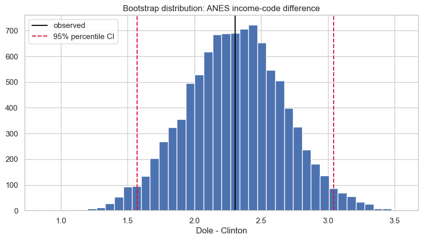

# Lesson 11: Nonparametric, Permutation, and Bootstrap Methods

> **Authoritative lesson:** This Markdown file is the maintained teaching source. The notebook is a supporting,
> executable example and should not be used to overwrite this lesson.

## Lesson overview

Rank, permutation, and bootstrap methods use ordering or resampling to answer questions that standard formulas may not address well.

### Why this matters

They broaden inference while keeping the target statistic and independent sampling unit explicit.

### Prerequisites

Two-group tests, sampling distributions, randomization, and basic programming loops.

## Learning objectives

1. Choose rank tests for ordinal or rank-based estimands
2. Construct a permutation test aligned with the null hypothesis
3. Use bootstrap confidence intervals while respecting the sampling unit
4. Recognize exchangeability and resampling limitations

## Concept map

The lesson covers the following concepts explicitly.

| Concept | Meaning | Teaching section |
|---|---|---|
| Rank tests | Use relative order rather than raw distances. | [11.1 Three families, three ideas](#111-three-families-three-ideas) |
| Permutation test | Generate a null distribution by justified label rearrangement. | [11.1 Three families, three ideas](#111-three-families-three-ideas) |
| Custom mean-difference statistic | Define the exact estimand passed to the permutation engine. | [11.1 Three families, three ideas](#111-three-families-three-ideas) |
| Mann–Whitney comparison | Contrast the permutation mean test with a rank-based procedure. | [11.1 Three families, three ideas](#111-three-families-three-ideas) |
| Bootstrap sampling distribution | Resample within independent groups to estimate uncertainty. | [11.1 Three families, three ideas](#111-three-families-three-ideas) |
| Percentile bootstrap interval | Use empirical bootstrap quantiles as interval endpoints. | [11.1 Three families, three ideas](#111-three-families-three-ideas) |
| Exchangeability | Justifies which labels may be permuted under the null. | [11.2 Exchangeability is the key permutation assumption](#112-exchangeability-is-the-key-permutation-assumption) |
| Cluster-aware resampling | Resample patients or clusters rather than dependent rows. | [Practice and solution](#practice-and-solution) |

## Data used in this lesson

The examples use the local, documented real-data bundle. See the [dataset guide](../../data/readme.md) for provenance,
variable definitions, cleaning decisions, and reuse notes.

| Dataset | Observation unit | Lesson use | Interpretation boundary |
|---|---|---|---|
| ANES 1996 | one survey respondent | Income-category differences between expected-vote groups illustrate permutation, rank, and bootstrap methods. | Unrestricted permutation assumes exchangeability; the observational example is pedagogical. |

## Notebook setup

The examples use the shared scientific-Python setup described in the
[Notebook Implementation Toolkit](../../docs/maintenance/notebook_toolkit.md). That reference explains imports, deterministic random-number
generation, plotting configuration, output behavior, and why global warning suppression is discouraged.

## 11.1 Three families, three ideas

- **Rank tests** replace raw values with order information and target rank/distribution contrasts.
- **Permutation tests** generate a null distribution by shuffling labels in a way justified by the null.
- **Bootstrap intervals** approximate sampling uncertainty by resampling observational units.

None of these methods repairs biased sampling, dependence, confounding, or the wrong unit of analysis.


```python
anes = pd.read_csv(DATA_DIR / "anes96_clean.csv")
clinton = anes.loc[anes["expected_vote"] == "Clinton", "income_code"].to_numpy()
dole = anes.loc[anes["expected_vote"] == "Dole", "income_code"].to_numpy()
observed_diff = dole.mean()-clinton.mean()

def mean_difference(x, y, axis=0):
    return np.mean(y, axis=axis)-np.mean(x, axis=axis)

perm = stats.permutation_test((clinton, dole), mean_difference,
                              permutation_type="independent", alternative="two-sided",
                              n_resamples=9999, random_state=20260920)
mw = stats.mannwhitneyu(dole, clinton, alternative="two-sided")
pd.Series({"observed income-code difference (Dole-Clinton)": observed_diff,
           "permutation p": perm.pvalue, "Mann-Whitney U": mw.statistic,
           "Mann-Whitney p": mw.pvalue})

```


    observed income-code difference (Dole-Clinton)    2.3048e+00
    permutation p                                     2.0000e-04
    Mann-Whitney U                                    1.3210e+05
    Mann-Whitney p                                    7.3009e-09
    dtype: float64


```python
bootstrap_diffs = np.empty(10000)
for i in range(len(bootstrap_diffs)):
    clinton_star = rng.choice(clinton, size=len(clinton), replace=True)
    dole_star = rng.choice(dole, size=len(dole), replace=True)
    bootstrap_diffs[i] = dole_star.mean()-clinton_star.mean()
percentile_ci = np.quantile(bootstrap_diffs, [.025, .975])

fig, ax = plt.subplots()
ax.hist(bootstrap_diffs, bins=40, edgecolor="white")
ax.axvline(observed_diff, color="black", label="observed")
ax.axvline(percentile_ci[0], color="crimson", linestyle="--")
ax.axvline(percentile_ci[1], color="crimson", linestyle="--", label="95% percentile CI")
ax.set(title="Bootstrap distribution: ANES income-code difference", xlabel="Dole - Clinton")
ax.legend(); plt.show()
print(f"95% bootstrap percentile CI: [{percentile_ci[0]:.2f}, {percentile_ci[1]:.2f}]")

```


    

    


    95% bootstrap percentile CI: [1.57, 3.04]


## 11.2 Exchangeability is the key permutation assumption

Under the sharp null in a randomized experiment, treatment labels can be shuffled according to the
randomization scheme. In observational data, unrestricted shuffling assumes groups are exchangeable.
Paired data require sign-flips or within-pair swaps; clustered experiments require cluster-level
permutations.


## Worked example and interpretation

### Different procedures answer different questions

The ANES example compares *income-category codes* between expected-vote groups. The Dole minus Clinton mean-code difference is 2.305. A permutation test repeatedly reallocates complete respondent labels across the two independent groups and obtains p = 0.0002 for a mean-difference statistic under exchangeability. Mann–Whitney compares ranks and also finds separation (p about 7.3 × 10⁻⁹), but its estimand is not the same as a difference of means or automatically a difference of medians. The permutation result depends on which labels are exchangeable under the null; it would be invalid to shuffle individual rows when observations are paired or clustered.

### Bootstrap uncertainty

The notebook resamples respondents **within each group** 10,000 times and recalculates the mean-code difference. The resulting percentile 95% interval is 1.57 to 3.04 category-code units. It quantifies uncertainty for this estimator under the empirical-resampling assumptions; it is not a null test. Because `income_code` is an ordered category, the numerical difference does not mean a currency amount. The simple percentile interval is introductory and can perform poorly with skew, small samples, or difficult dependence structures.

## Practice and solution

**Practice.** You have 10 measurements from each of 20 patients. What should a simple bootstrap resample?

<details><summary>Solution</summary>

If patients are the independent sampling units, resample patients (clusters), carrying all their
measurements together. Resampling 200 rows independently creates pseudo-replication and usually
understates uncertainty.
</details>

## Summary

- Resample or permute the true independent unit.
- Use a statistic that directly represents the estimand.
- Computational methods still require design assumptions and transparent reporting.


## Reproducibility checklist

- State the population, outcome, groups, and sampling unit.
- State $H_0$, $H_1$, alpha, and whether the test is one- or two-sided before looking at results.
- Verify independence from the design; use plots and diagnostics for distributional assumptions.
- Report the estimate, confidence interval, effect size, test statistic, degrees of freedom, and exact p-value.
- Separate statistical evidence from practical importance and acknowledge design limitations.

## Implementation reference

These APIs and code patterns are demonstrated in the supporting notebook.

| API or pattern | Purpose | Usage guidance |
|---|---|---|
| `pandas.read_csv` | Load the cleaned ANES observations used in the resampling examples. | Resample the independent observational unit, not arbitrary dependent rows. |
| `scipy.stats.permutation_test` | Run a resampling test around a custom statistic. | Match `permutation_type` to independent, paired, or sample structure. |
| `numpy.random.Generator.choice(..., replace=True)` | Draw bootstrap samples. | Resample the independent unit within the correct strata. |
| `numpy.quantile` | Read percentile interval endpoints from bootstrap replicates. | Percentile intervals are simple but not universally optimal. |
| `numpy.empty` | Preallocate a simulation array. | Preallocation avoids repeated array growth in loops. |

## Best practices

- Define the statistic before choosing the resampling method.
- Resample the independent unit.
- Set and report the random seed and number of resamples.

## Common mistakes and edge cases

- Assuming nonparametric means assumption-free.
- Permuting labels that are not exchangeable.
- Bootstrapping rows independently in clustered data.

## Additional practice

1. Design a paired permutation test using within-pair sign flips.
2. Explain when a percentile bootstrap interval may be unreliable.

## Related lessons and source material

- **Previous:** [Lesson 10 Correlation and Regression-Based Tests](../../level_2_applied_testing/markdown/lesson_10_correlation_and_regression_based_tests.md)
- **Next:** [Lesson 12 Multiple Testing Equivalence and Evidence Beyond Significance](lesson_12_multiple_testing_equivalence_and_evidence_beyond_significance.md)
- **Supporting notebook:** [lesson_11_nonparametric_permutation_and_bootstrap_methods.ipynb](../lesson_11_nonparametric_permutation_and_bootstrap_methods.ipynb)
- **Coverage record:** [Course Coverage Index](../../docs/maintenance/course_coverage_index.md#lesson-11-nonparametric-permutation-and-bootstrap-methods)
