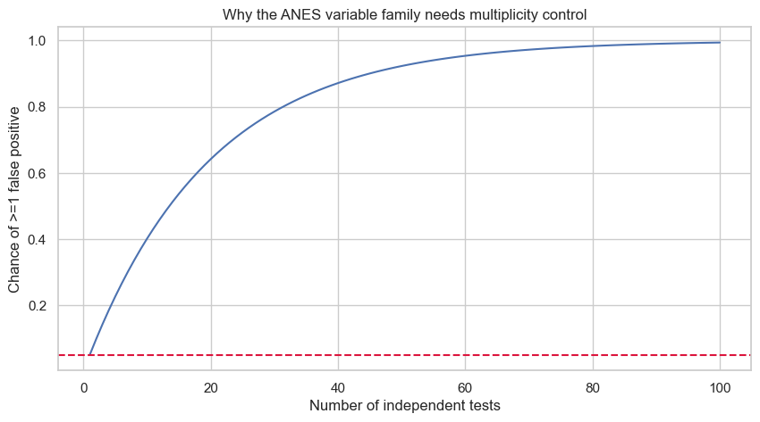

# Lesson 12: Multiple Testing, Equivalence, and Evidence Beyond Significance

> **Authoritative lesson:** This Markdown file is the maintained teaching source. The notebook is a supporting,
> executable example and should not be used to overwrite this lesson.

## Lesson overview

Multiplicity procedures control error across a family of hypotheses, while equivalence tests evaluate whether effects are small enough to be practically negligible.

### Why this matters

Both prevent common binary-significance errors: selective discoveries and declaring equivalence from non-significance.

### Prerequisites

Type I error, confidence intervals, t distributions, and families of related tests.

## Learning objectives

1. Control family-wise error or false discovery rate for multiple hypotheses
2. Distinguish confirmatory and exploratory analyses
3. Use equivalence testing to support a claim of practically negligible difference
4. Explain how estimation and sensitivity analyses improve binary decisions

## Concept map

The lesson covers the following concepts explicitly.

| Concept | Meaning | Teaching section |
|---|---|---|
| Family-wise error rate | Probability of at least one false rejection in a family. | [12.1 Multiple comparisons](#121-multiple-comparisons) |
| Bonferroni correction | Conservative family-wise control by scaling thresholds or p-values. | [12.1 Multiple comparisons](#121-multiple-comparisons) |
| Holm correction | Sequential family-wise procedure that improves on simple Bonferroni. | [12.1 Multiple comparisons](#121-multiple-comparisons) |
| Benjamini–Hochberg FDR | Control the expected false discovery proportion under its conditions. | [12.1 Multiple comparisons](#121-multiple-comparisons) |
| Hypothesis family | Define which tests belong to one error-control decision. | [12.1 Multiple comparisons](#121-multiple-comparisons) |
| Equivalence bounds | Pre-specified smallest effects considered meaningfully different. | [12.2 Equivalence is not non-significance](#122-equivalence-is-not-non-significance) |
| Two one-sided tests (TOST) | Reject effects at or beyond both equivalence margins. | [12.2 Equivalence is not non-significance](#122-equivalence-is-not-non-significance) |
| 90% interval for equivalence at alpha .05 | Interval must lie entirely within the equivalence bounds. | [12.2 Equivalence is not non-significance](#122-equivalence-is-not-non-significance) |

## Data used in this lesson

The examples use the local, documented real-data bundle. See the [dataset guide](../../data/readme.md) for provenance,
variable definitions, cleaning decisions, and reuse notes.

| Dataset | Observation unit | Lesson use | Interpretation boundary |
|---|---|---|---|
| ANES 1996 | one survey respondent | Seven vote-group comparisons define a multiplicity family; age supports a TOST example. | The ±3-year equivalence margin is a teaching choice that would require substantive justification in practice. |

## Notebook setup

The examples use the shared scientific-Python setup described in the
[Notebook Implementation Toolkit](../../docs/maintenance/notebook_toolkit.md). That reference explains imports, deterministic random-number
generation, plotting configuration, output behavior, and why global warning suppression is discouraged.

## 12.1 Multiple comparisons

With $m$ independent tests at level $\alpha$, the chance of at least one false positive is
$1-(1-\alpha)^m$. Bonferroni and Holm control family-wise error; Benjamini–Hochberg controls the expected
false discovery proportion under its assumptions. Define the hypothesis family from the decision
context rather than correcting every p-value ever computed.


```python
from statsmodels.stats.multitest import multipletests

anes = pd.read_csv(DATA_DIR / "anes96_clean.csv")
variables = ["age_years", "tv_news_days_per_week", "education_code", "income_code",
             "self_left_right", "clinton_left_right", "dole_left_right"]
rows = []
for variable in variables:
    clinton = anes.loc[anes["expected_vote"] == "Clinton", variable].dropna()
    dole = anes.loc[anes["expected_vote"] == "Dole", variable].dropna()
    result = stats.ttest_ind(dole, clinton, equal_var=False)
    rows.append({"variable": variable, "Dole-Clinton difference": dole.mean()-clinton.mean(),
                 "raw p": result.pvalue})
results = pd.DataFrame(rows)
for method, label in [("bonferroni", "Bonferroni"), ("holm", "Holm"), ("fdr_bh", "BH-FDR")]:
    reject, adjusted, _, _ = multipletests(results["raw p"], alpha=.05, method=method)
    results[f"{label} p"] = adjusted
    results[f"{label} reject"] = reject
results

```


| Term | variable | Dole-Clinton difference | raw p | Bonferroni p | Bonferroni reject | Holm p | Holm reject | BH-FDR p | BH-FDR reject |
|---|---|---|---|---|---|---|---|---|---|
| 0 | age_years | 1.787 | 0.09951 | 0.6966 | False | 0.2985 | False | 0.1393 | False |
| 1 | tv_news_days_per_week | -0.0785 | 0.6577 | 1 | False | 1 | False | 0.6577 | False |
| 2 | education_code | 0.2776 | 0.007918 | 0.05543 | False | 0.03167 | True | 0.01386 | True |
| 3 | income_code | 2.305 | 1.255e-09 | 8.785e-09 | True | 6.275e-09 | True | 2.928e-09 | True |
| 4 | self_left_right | 1.701 | 3.739e-92 | 2.618e-91 | True | 2.618e-91 | True | 2.618e-91 | True |
| 5 | clinton_left_right | -1.309 | 8.681e-57 | 6.077e-56 | True | 5.209e-56 | True | 3.039e-56 | True |
| 6 | dole_left_right | 0.0485 | 0.5323 | 1 | False | 1 | False | 0.621 | False |


```python
m = np.arange(1, 101)
fwer = 1-(1-.05)**m
fig, ax = plt.subplots()
ax.plot(m, fwer)
ax.axhline(.05, color="crimson", linestyle="--")
ax.set(xlabel="Number of independent tests", ylabel="Chance of >=1 false positive",
       title="Why the ANES variable family needs multiplicity control")
plt.show()

```


    

    


## 12.2 Equivalence is not non-significance

To support that an effect is small enough to be practically negligible, define equivalence bounds
$[-\Delta, +\Delta]$ before analysis. The two one-sided tests (TOST) procedure rejects effects at or
beyond both bounds. Equivalently, the $(1-2\alpha)$ confidence interval must lie wholly inside the bounds.


```python
dole_age = anes.loc[anes["expected_vote"] == "Dole", "age_years"].to_numpy()
clinton_age = anes.loc[anes["expected_vote"] == "Clinton", "age_years"].to_numpy()
difference = dole_age.mean()-clinton_age.mean()
v1, v2 = dole_age.var(ddof=1), clinton_age.var(ddof=1)
n1, n2 = len(dole_age), len(clinton_age)
se = np.sqrt(v1/n1+v2/n2)
df = (v1/n1+v2/n2)**2/((v1/n1)**2/(n1-1)+(v2/n2)**2/(n2-1))
margin = 3.0  # years; a teaching equivalence threshold
t_lower = (difference-(-margin))/se
t_upper = (difference-margin)/se
p_lower = stats.t.sf(t_lower, df)
p_upper = stats.t.cdf(t_upper, df)
p_tost = max(p_lower, p_upper)
ci90 = difference + np.array([-1, 1])*stats.t.ppf(.95, df)*se
pd.Series({"age difference (Dole-Clinton)": difference, "equivalence margin": margin,
           "90% CI low": ci90[0], "90% CI high": ci90[1],
           "TOST p": p_tost, "equivalent within +/-3 years": p_tost < .05})

```


    age difference (Dole-Clinton)    1.7871
    equivalence margin                  3.0
    90% CI low                       0.0026
    90% CI high                      3.5715
    TOST p                           0.1317
    equivalent within +/-3 years      False
    dtype: object


## Worked example and interpretation

### A family of seven comparisons

The first ANES analysis compares Dole and Clinton expected-vote groups on seven outcomes and adjusts the resulting p-values as one family. Income code and two political-placement measures remain clear under Bonferroni, Holm, and Benjamini–Hochberg adjustment. Education code illustrates the methods' different error targets: its raw p-value is 0.0079, Bonferroni-adjusted p is 0.0554, Holm-adjusted p is 0.0317, and BH-adjusted p is 0.0139. The methods therefore do not yield the same reject/not-reject label for this outcome. Family-wise error control and false-discovery-rate control answer different planning questions; choose the family and rule before examining the smallest p-value.

### Equivalence is a new hypothesis

A separate calculation asks whether the mean age difference is small enough to fit a **teaching** equivalence margin of ±3 years. The observed Dole-minus-Clinton difference is 1.787 years, but its 90% interval is 0.003 to 3.572 years. Because the upper limit exceeds +3, the interval is not contained within the equivalence bounds; the two-one-sided-tests p-value is 0.132. Thus neither a conventional non-significant difference test nor this equivalence test establishes equivalence. In applied work, the ±3-year margin needs subject-matter justification set in advance.

## Practice and solution

**Practice.** A conventional test gives p=.40. Can you conclude equivalence within ±2 units?

<details><summary>Solution</summary>

No. A non-significant difference test only says the data do not clearly exclude zero. Run a planned
equivalence test with bounds ±2. Equivalence is supported only if the corresponding 90% CI lies entirely
within those bounds at alpha .05.
</details>

## Summary

- Multiplicity control must match the hypothesis family and error criterion.
- Exploratory findings should be labeled and independently validated.
- Equivalence testing turns "close enough" into a precise, testable claim.


## Reproducibility checklist

- State the population, outcome, groups, and sampling unit.
- State $H_0$, $H_1$, alpha, and whether the test is one- or two-sided before looking at results.
- Verify independence from the design; use plots and diagnostics for distributional assumptions.
- Report the estimate, confidence interval, effect size, test statistic, degrees of freedom, and exact p-value.
- Separate statistical evidence from practical importance and acknowledge design limitations.

## Implementation reference

These APIs and code patterns are demonstrated in the supporting notebook.

| API or pattern | Purpose | Usage guidance |
|---|---|---|
| `statsmodels.stats.multitest.multipletests` | Apply Bonferroni, Holm, or BH adjustments. | Report the method, hypothesis family, and adjusted p-values. |
| `scipy.stats.t.sf` and `t.cdf` | Calculate the two one-sided TOST p-values. | The TOST p-value is the larger of the two component p-values. |
| `scipy.stats.t.ppf` | Construct the 90% t interval used by alpha-.05 TOST. | Equivalence bounds must be chosen before looking at the estimate. |

## Best practices

- Define the family and error criterion before analysis.
- Label exploratory tests and validate them independently.
- Choose equivalence bounds from practical consequences.

## Common mistakes and edge cases

- Correcting an arbitrary set of unrelated tests.
- Treating adjusted p-values as effect sizes.
- Concluding equivalence because a difference test is non-significant.

## Additional practice

1. Compare Holm and BH for a confirmatory versus exploratory study.
2. Draw a 90% interval that supports equivalence and one that is inconclusive.

## Related lessons and source material

- **Previous:** [Lesson 11 Nonparametric Permutation and Bootstrap Methods](lesson_11_nonparametric_permutation_and_bootstrap_methods.md)
- **Next:** [Lesson 13 Advanced Designs Clustering and Time-to-Event Outcomes](lesson_13_advanced_designs_clustering_and_time_to_event_outcomes.md)
- **Supporting notebook:** [lesson_12_multiple_testing_equivalence_and_evidence_beyond_significance.ipynb](../lesson_12_multiple_testing_equivalence_and_evidence_beyond_significance.ipynb)
- **Coverage record:** [Course Coverage Index](../../docs/maintenance/course_coverage_index.md#lesson-12-multiple-testing-equivalence-and-evidence-beyond-significance)
