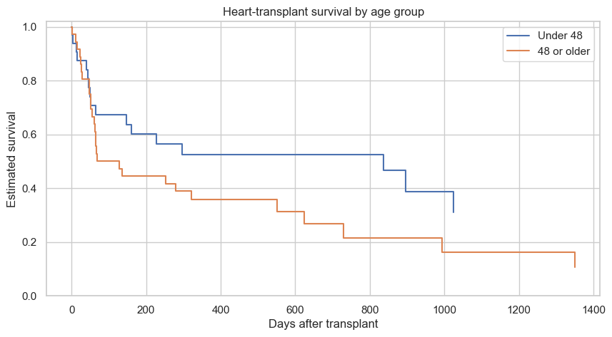

# Lesson 13: Advanced Designs: Clustering and Time-to-Event Outcomes

> **Authoritative lesson:** This Markdown file is the maintained teaching source. The notebook is a supporting,
> executable example and should not be used to overwrite this lesson.

## Lesson overview

Advanced designs model dependence between observations and partial observation of event times.

### Why this matters

Ignoring clusters or censoring typically produces incorrect uncertainty and can change the question being answered.

### Prerequisites

Regression, interactions, repeated measurements, probability, and time-to-event terminology.

## Learning objectives

1. Recognize pseudo-replication caused by clustered observations
2. Fit and interpret a random-intercept mixed model
3. Explain censoring and compare survival curves with a log-rank test
4. Know when specialist methods are required instead of a basic test

## Concept map

The lesson covers the following concepts explicitly.

| Concept | Meaning | Teaching section |
|---|---|---|
| Clustering and pseudo-replication | Repeated rows within a firm are correlated and are not independent replicates. | [13.1 Clustered and longitudinal data](#131-clustered-and-longitudinal-data) |
| Random-intercept mixed model | Represent firm-specific investment baselines through a random effect. | [13.1 Clustered and longitudinal data](#131-clustered-and-longitudinal-data) |
| Time-by-firm-size interaction | Compare longitudinal investment trajectories across data-derived firm-size groups. | [13.1 Clustered and longitudinal data](#131-clustered-and-longitudinal-data) |
| Mixed models versus GEE or cluster-level analysis | Different approaches target different inferential perspectives. | [13.1 Clustered and longitudinal data](#131-clustered-and-longitudinal-data) |
| Censoring | Observed survival is a lower bound when the event was not recorded during follow-up. | [13.2 Time-to-event data and censoring](#132-time-to-event-data-and-censoring) |
| Risk sets and log-rank test | Compare observed and expected deaths across age groups at each event time. | [13.2 Time-to-event data and censoring](#132-time-to-event-data-and-censoring) |
| Kaplan–Meier estimator | Multiply conditional survival probabilities across observed event times. | [13.2 Time-to-event data and censoring](#132-time-to-event-data-and-censoring) |
| Cluster-randomized inference | Power and analysis follow the randomized cluster, not the row count. | [Practice and solution](#practice-and-solution) |

## Data used in this lesson

The examples use the local, documented real-data bundle. See the [dataset guide](../../data/readme.md) for provenance,
variable definitions, cleaning decisions, and reuse notes.

| Dataset | Observation unit | Lesson use | Interpretation boundary |
|---|---|---|---|
| Grunfeld investment | one firm-year | Repeated firm observations support a random-intercept longitudinal model. | The firm-size split is derived from the same data and is descriptive. |
| Heart-transplant survival | one patient | Follow-up time and observed deaths illustrate censoring, log-rank testing, and Kaplan–Meier curves. | The age split is derived for teaching and was not randomized. |

## Notebook setup

The examples use the shared scientific-Python setup described in the
[Notebook Implementation Toolkit](../../docs/maintenance/notebook_toolkit.md). That reference explains imports, deterministic random-number
generation, plotting configuration, output behavior, and why global warning suppression is discouraged.

## 13.1 Clustered and longitudinal data

The Grunfeld investment data contain 20 yearly observations for each of 11 firms. Rows from the same firm are correlated,
so treating all 220 rows as independent would understate uncertainty. A random-intercept model represents firm-specific
baselines while estimating change over time.


```python
import statsmodels.formula.api as smf

longitudinal = pd.read_csv(DATA_DIR / "grunfeld_investment.csv")
longitudinal["year_centered"] = longitudinal["year"]-longitudinal["year"].min()
firm_mean_value = longitudinal.groupby("firm")["market_value"].transform("mean")
longitudinal["large_firm"] = (firm_mean_value >= firm_mean_value.median()).astype(int)
longitudinal["log_investment"] = np.log1p(longitudinal["investment"])

mixed = smf.mixedlm("log_investment ~ year_centered * large_firm", longitudinal,
                    groups=longitudinal["firm"]).fit()
mixed.summary().tables[1]

```


| Term | Coef. | Std.Err. | z | P>|z| | [0.025 | 0.975] |
|---|---|---|---|---|---|---|
| Intercept | 2.617 | 0.524 | 4.998 | 0 | 1.591 | 3.643 |
| year_centered | 0.039 | 0.005 | 8.511 | 0 | 0.03 | 0.048 |
| large_firm | 1.554 | 0.709 | 2.193 | 0.028 | 0.165 | 2.944 |
| year_centered:large_firm | 0.026 | 0.006 | 4.154 | 0 | 0.014 | 0.038 |
| Group Var | 1.358 | 2.472 |  |  |  |  |


## 13.2 Time-to-event data and censoring

The heart-transplant dataset records follow-up days, age, and whether death was observed. A censored patient contributes
information up to the last known follow-up time. The log-rank test compares observed and expected events across age-group
risk sets; the age groups are derived for teaching and were not randomized.


```python
def logrank_two_sample(time, event, group):
    event_times = np.sort(np.unique(time[event == 1]))
    observed_1 = expected_1 = variance = 0.0
    for t in event_times:
        at_risk = time >= t
        n1 = np.sum(at_risk & (group == 1)); n0 = np.sum(at_risk & (group == 0))
        d1 = np.sum((time == t) & (event == 1) & (group == 1))
        d0 = np.sum((time == t) & (event == 1) & (group == 0))
        n, d = n1+n0, d1+d0
        if n <= 1:
            continue
        observed_1 += d1
        expected_1 += d*n1/n
        variance += (n1*n0*d*(n-d))/(n**2*(n-1))
    chi2 = (observed_1-expected_1)**2/variance
    return chi2, stats.chi2.sf(chi2, 1)

heart = pd.read_csv(DATA_DIR / "heart_transplant_survival.csv")
time = heart["survival_days"].to_numpy()
event = heart["event_observed"].to_numpy()
group = (heart["age_group"] == "48 or older").astype(int).to_numpy()
lr_chi2, lr_p = logrank_two_sample(time, event, group)
pd.Series({"patients": len(heart), "events": event.sum(), "censored": len(heart)-event.sum(),
           "log-rank chi-square": lr_chi2, "p": lr_p})

```


    patients               69.0000
    events                 45.0000
    censored               24.0000
    log-rank chi-square     2.6220
    p                       0.1054
    dtype: float64


```python
def km_curve(time, event):
    times = np.sort(np.unique(time[event == 1]))
    survival = 1.0
    xs, ys = [0.0], [1.0]
    for t in times:
        n_risk = np.sum(time >= t)
        d = np.sum((time == t) & (event == 1))
        survival *= (1-d/n_risk)
        xs.extend([t, t]); ys.extend([ys[-1], survival])
    return xs, ys

fig, ax = plt.subplots()
for label, g in [("Under 48", 0), ("48 or older", 1)]:
    xg, yg = km_curve(time[group == g], event[group == g])
    ax.step(xg, yg, where="post", label=label)
ax.set(xlabel="Days after transplant", ylabel="Estimated survival", ylim=(0, 1.02),
       title="Heart-transplant survival by age group")
ax.legend(); plt.show()

```


    

    


## Worked example and interpretation

### Correlation within firms

The Grunfeld data contain 220 yearly records from 11 firms. A random-intercept mixed model lets each firm have its own baseline log-investment level while estimating time, a derived large-firm indicator, and their interaction. The fitted baseline time slope is 0.039 log units per year; the large-firm interaction adds about 0.026 log units per year under the model. These conditional slopes describe associations in historical panel data. The firm, rather than each row, is the independent cluster for uncertainty; treating all 220 rows as unrelated would overstate information. The large-firm label is derived from observed market value, so its coefficient is not a randomized treatment effect.

### Censored follow-up

The heart-transplant example has 69 patients, 45 recorded events, and 24 censored follow-ups. The hand-built log-rank calculation compares age groups at observed event times using the number still at risk; it gives chi-square = 2.622 and p = 0.105. The Kaplan–Meier steps update estimated survival only at events while censored patients contribute information up to their last follow-up. A non-significant comparison does not establish identical survival curves. Interpretation requires credible censoring and group definitions, and applied survival work should use validated routines with uncertainty bands and appropriate tie handling.

## Practice and solution

**Practice.** A trial randomizes 20 clinics, then measures 50 patients per clinic. Is $n=1000$ for an
ordinary independent t-test?

<details><summary>Solution</summary>

No. Treatment was randomized at the clinic level and patients within clinics are correlated. The design
has 20 independent clusters. Use a cluster-aware analysis—such as a clinic-level comparison, mixed
model, GEE, or cluster-randomization method—and plan power using the intraclass correlation.
</details>

## Summary

- The independent unit is determined by sampling and randomization, not the number of rows.
- Censoring requires survival methods.
- Advanced tests should be chosen with domain and design expertise.


## Reproducibility checklist

- State the population, outcome, groups, and sampling unit.
- State $H_0$, $H_1$, alpha, and whether the test is one- or two-sided before looking at results.
- Verify independence from the design; use plots and diagnostics for distributional assumptions.
- Report the estimate, confidence interval, effect size, test statistic, degrees of freedom, and exact p-value.
- Separate statistical evidence from practical importance and acknowledge design limitations.

## Implementation reference

These APIs and code patterns are demonstrated in the supporting notebook.

| API or pattern | Purpose | Usage guidance |
|---|---|---|
| `statsmodels.formula.api.mixedlm` | Fit a random-intercept model grouped by firm. | Name the grouping unit and interpret the time interaction on the log-investment scale. |
| `DataFrame.groupby(...).transform` | Create a data-derived firm-size indicator without losing rows. | The grouping is descriptive and was not randomized. |
| `scipy.stats.chi2.sf` | Convert the educational log-rank statistic to a p-value. | Use a validated survival library for production analyses. |
| `Axes.step(..., where='post')` | Draw Kaplan–Meier-style survival curves. | Production plots should also show censoring marks and confidence bands. |

## Best practices

- Identify the independent sampling or randomization unit first.
- Use validated mixed-model and survival routines for applied analyses.
- Report censoring patterns and model assumptions.

## Common mistakes and edge cases

- Using the number of rows as the independent sample size.
- Dropping censored cases or treating censoring times as events.
- Using the teaching log-rank implementation as a production library.

## Additional practice

1. Explain how intraclass correlation changes effective sample size.
2. Construct a risk set at one event time and calculate its expected group event count.

## Related lessons and source material

- **Previous:** [Lesson 12 Multiple Testing Equivalence and Evidence Beyond Significance](lesson_12_multiple_testing_equivalence_and_evidence_beyond_significance.md)
- **Next:** [Lesson 14 Test Selection and End-to-End Capstone](lesson_14_test_selection_and_end_to_end_capstone.md)
- **Supporting notebook:** [lesson_13_advanced_designs_clustering_and_time_to_event_outcomes.ipynb](../lesson_13_advanced_designs_clustering_and_time_to_event_outcomes.ipynb)
- **Coverage record:** [Course Coverage Index](../../docs/maintenance/course_coverage_index.md#lesson-13-advanced-designs-clustering-and-time-to-event-outcomes)
