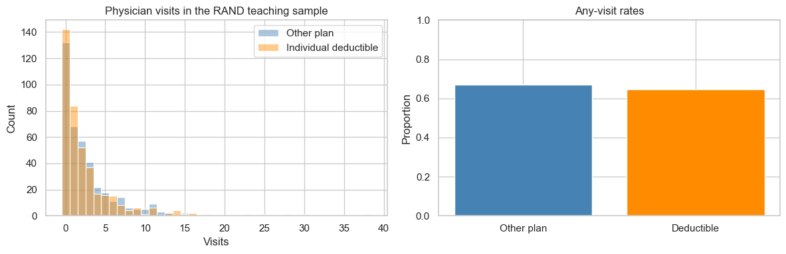

# Lesson 14: Test Selection and End-to-End Capstone

> **Authoritative lesson:** This Markdown file is the maintained teaching source. The notebook is a supporting,
> executable example and should not be used to overwrite this lesson.

## Lesson overview

An end-to-end analysis aligns the decision, estimand, design, diagnostics, inference, and reporting in one reproducible workflow.

### Why this matters

Correct individual tests can still produce a misleading project when the wrong unit, metric, contrast, or reporting frame is used.

### Prerequisites

Lessons 1–13, especially Welch tests, proportion tests, bootstrap intervals, and multiplicity.

## Learning objectives

1. Use outcome type, design, estimand, and assumptions to select a test
2. Complete a reproducible analysis from question through communication
3. Audit a result for common validity threats
4. Write a concise statistical results paragraph

## Concept map

The lesson covers the following concepts explicitly.

| Concept | Meaning | Teaching section |
|---|---|---|
| Seven-step test-selection sequence | Move from decision and estimand through design, diagnostics, inference, and communication. | [14.1 Decision sequence](#141-decision-sequence) |
| RAND HIE capstone | Compare physician-use outcomes between two insurance-plan groups in the balanced teaching subset. | [14.2 Capstone scenario](#142-capstone-scenario) |
| Primary and secondary estimands | Distinguish the mean visit-count difference from the any-visit risk difference. | [14.2 Capstone scenario](#142-capstone-scenario) |
| Welch test plus bootstrap interval | Combine a mean comparison with a resampled interval for the visit-count difference. | [14.2 Capstone scenario](#142-capstone-scenario) |
| Two-proportion test | Analyze the secondary any-physician-visit outcome. | [14.2 Capstone scenario](#142-capstone-scenario) |
| Holm adjustment across outcomes | Control family-wise error for the two planned claims. | [14.2 Capstone scenario](#142-capstone-scenario) |
| Comparative visualization | Show visit-count distributions and any-visit rates. | [14.2 Capstone scenario](#142-capstone-scenario) |
| Results-paragraph template | Report estimates, intervals, statistics, adjustment, provenance, and limitations. | [14.3 Reporting template](#143-reporting-template) |

## Data used in this lesson

The examples use the local, documented real-data bundle. See the [dataset guide](../../data/readme.md) for provenance,
variable definitions, cleaning decisions, and reuse notes.

| Dataset | Observation unit | Lesson use | Interpretation boundary |
|---|---|---|---|
| RAND Health Insurance Experiment teaching sample | one participant | Physician-visit counts and any-visit indicators form the two-outcome capstone. | The balanced subset is intentionally simple and does not replace a complete analysis of the original experiment. |

## Notebook setup

The examples use the shared scientific-Python setup described in the
[Notebook Implementation Toolkit](../../docs/maintenance/notebook_toolkit.md). That reference explains imports, deterministic random-number
generation, plotting configuration, output behavior, and why global warning suppression is discouraged.

## 14.1 Decision sequence

1. **Question:** What decision will the analysis support?
2. **Estimand:** Mean difference, risk difference, odds ratio, rank contrast, correlation, or survival contrast?
3. **Outcome:** Quantitative, ordinal, categorical, count, or time-to-event?
4. **Design:** One sample, independent groups, paired/repeated, clustered, randomized, or observational?
5. **Diagnostics:** Independence, shape/outliers, variance pattern, expected counts, censoring mechanism?
6. **Inference:** Estimate + CI + effect size + test, with multiplicity handling.
7. **Communication:** Practical meaning, uncertainty, limitations, and next action.


## 14.2 Capstone scenario

The capstone uses the balanced RAND Health Insurance Experiment teaching sample. The primary outcome is the number of
physician visits; the secondary outcome is whether any visit occurred. We compare individual-deductible and other plans,
bootstrap the mean visit difference, test the binary rate difference, and apply Holm adjustment across the two claims.


```python
rand = pd.read_csv(DATA_DIR / "rand_hie_teaching_sample.csv")
other = rand.loc[rand["plan_group"] == "Other plan", "physician_visits"].to_numpy()
deductible = rand.loc[rand["plan_group"] == "Individual deductible", "physician_visits"].to_numpy()

visit_test = stats.ttest_ind(deductible, other, equal_var=False)
observed_visit_diff = deductible.mean()-other.mean()
boot = np.empty(5000)
for i in range(len(boot)):
    boot[i] = (rng.choice(deductible, len(deductible), replace=True).mean()
               - rng.choice(other, len(other), replace=True).mean())
visit_ci = np.quantile(boot, [.025, .975])

from statsmodels.stats.proportion import proportions_ztest
summary = rand.groupby("plan_group")["any_physician_visit"].agg(["sum", "count"])
successes = np.array([summary.loc["Individual deductible", "sum"], summary.loc["Other plan", "sum"]])
totals = np.array([summary.loc["Individual deductible", "count"], summary.loc["Other plan", "count"]])
z, any_visit_p = proportions_ztest(successes, totals)

from statsmodels.stats.multitest import multipletests
raw_ps = [visit_test.pvalue, any_visit_p]
holm_ps = multipletests(raw_ps, method="holm")[1]
capstone = pd.DataFrame({
    "outcome": ["Number of physician visits", "Any physician visit"],
    "estimate": [observed_visit_diff, successes[0]/totals[0]-successes[1]/totals[1]],
    "raw p": raw_ps, "Holm p": holm_ps,
    "units": ["visits (deductible-other)", "proportion points (deductible-other)"]})
capstone

```


| Term | outcome | estimate | raw p | Holm p | units |
|---|---|---|---|---|---|
| 0 | Number of physician visits | -0.3175 | 0.2383 | 0.4766 | visits (deductible-other) |
| 1 | Any physician visit | -0.025 | 0.4563 | 0.4766 | proportion points (deductible-other) |


```python
fig, axes = plt.subplots(1, 2, figsize=(12, 4))
sns.histplot(other, discrete=True, color="steelblue", alpha=.45, label="Other plan", ax=axes[0])
sns.histplot(deductible, discrete=True, color="darkorange", alpha=.45,
             label="Individual deductible", ax=axes[0])
axes[0].set(title="Physician visits in the RAND teaching sample", xlabel="Visits")
axes[0].legend()
rates = [rand.loc[rand["plan_group"] == name, "any_physician_visit"].mean()
         for name in ["Other plan", "Individual deductible"]]
axes[1].bar(["Other plan", "Deductible"], rates, color=["steelblue", "darkorange"])
axes[1].set(title="Any-visit rates", ylabel="Proportion", ylim=(0, 1))
plt.tight_layout(); plt.show()
print(f"Visit difference 95% bootstrap CI: [{visit_ci[0]:.2f}, {visit_ci[1]:.2f}]")

```


    

    


    Visit difference 95% bootstrap CI: [-0.85, 0.21]


## 14.3 Reporting template

> In the RAND teaching sample, the individual-deductible group differed from the other-plan group by **[estimate]**
> physician visits (95% bootstrap CI **[low, high]**; Welch **t(df)=...**, Holm-adjusted **p=...**). The any-visit rate
> differed by **[absolute percentage points]** (adjusted **p=...**). These outcomes answer related but distinct questions.
> Interpretation is limited to the documented teaching subset and should include practical thresholds and uncertainty.


## Worked example and interpretation

### Walk through both outcomes

The balanced RAND HIE teaching subset compares individual-deductible with other plans. For the number of physician visits, the observed **deductible minus other-plan** mean difference is −0.318 visits. Welch's test gives p = 0.238, and a within-group bootstrap gives a 95% percentile interval from −0.85 to +0.21 visits. The plot shows the discrete, skewed count distribution that motivates checking a count-specific model in a fuller analysis. For the secondary binary outcome, the any-visit rate difference is −0.025, with a two-proportion test p = 0.456. These outcomes capture different aspects of utilization and should not be collapsed into one claim.

### Complete the decision

The notebook applies Holm adjustment to the two displayed p-values; both adjusted values are about 0.477. The analysis therefore does not provide clear evidence of a difference on either outcome at the planned 0.05 level. That statement is narrower than saying the plans are equivalent or have no effect, because the intervals still allow changes that may matter. This is a selected teaching sample, not the full experiment; a final causal report would revisit the original assignment, outcome definitions, missingness, the count model, multiplicity plan, and decision threshold.

## Practice and solution

**Practice.** List three checks needed before treating this teaching analysis as a complete experiment report.

<details><summary>Solution</summary>

Examples include analyzing the complete RAND sample rather than only the balanced teaching subset; verifying the original
randomization and observation unit; pre-specifying the primary outcome and useful effect; assessing count-model choices,
missingness, and adherence; and documenting whether additional outcomes or subgroups were examined.
</details>

## Summary

- Test selection begins with the design, outcome, and estimand.
- Real data remove arbitrary generated values but do not remove modeling assumptions.
- A complete report includes uncertainty, practical importance, provenance, and limitations.


## Reproducibility checklist

- State the population, outcome, groups, and sampling unit.
- State $H_0$, $H_1$, alpha, and whether the test is one- or two-sided before looking at results.
- Verify independence from the design; use plots and diagnostics for distributional assumptions.
- Report the estimate, confidence interval, effect size, test statistic, degrees of freedom, and exact p-value.
- Separate statistical evidence from practical importance and acknowledge design limitations.

## Implementation reference

These APIs and code patterns are demonstrated in the supporting notebook.

| API or pattern | Purpose | Usage guidance |
|---|---|---|
| `pandas.read_csv` | Load the local RAND HIE teaching sample. | Keep provenance and the teaching-subset limitation visible. |
| `scipy.stats.ttest_ind(..., equal_var=False)` | Test the mean physician-visit contrast. | Count outcomes may need a dedicated count model in applied work. |
| Bootstrap loop with `Generator.choice` | Estimate a percentile interval for the mean visit difference. | Resample participants within plan groups. |
| `proportions_ztest` | Test the any-physician-visit rate contrast. | Report the absolute rate difference as well as the p-value. |
| `multipletests(..., method='holm')` | Adjust the two outcome p-values. | Define the hypothesis family before seeing results. |

## Best practices

- Write the estimand before selecting the test.
- Keep primary, secondary, and exploratory claims distinct.
- End with a decision and limitations, not a p-value.

## Common mistakes and edge cases

- Combining conditional and assignment-based estimands as if they answer the same question.
- Ignoring post-treatment selection among converters.
- Treating a reproducible simulation as evidence about a real product.

## Additional practice

1. Rewrite the capstone with revenue as the primary outcome and identify the new estimand.
2. Audit the analysis for logging, interference, stopping, and missingness risks.

## Related lessons and source material

- **Previous:** [Lesson 13 Advanced Designs Clustering and Time-to-Event Outcomes](lesson_13_advanced_designs_clustering_and_time_to_event_outcomes.md)
- **Next:** [Lesson 15 Course Review and Statistical Reporting](lesson_15_course_review_and_statistical_reporting.md)
- **Supporting notebook:** [lesson_14_test_selection_and_end_to_end_capstone.ipynb](../lesson_14_test_selection_and_end_to_end_capstone.ipynb)
- **Coverage record:** [Course Coverage Index](../../docs/maintenance/course_coverage_index.md#lesson-14-test-selection-and-end-to-end-capstone)
